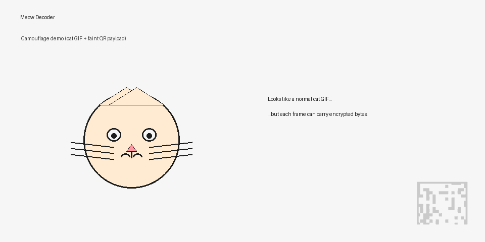

# 🐱 Meow Decoder

<p align="center">
  
</p>

<p align="center">
  <strong>Smuggle bytes through the air — Security-focused QR code encryption</strong>
</p>

<p align="center">
  <a href="https://github.com/systemslibrarian/meow-decoder/actions/workflows/security-ci.yml">
    
  </a>
  <a href="https://github.com/systemslibrarian/meow-decoder/actions/workflows/codeql.yml">
    
  </a>
  <a href="https://codecov.io/gh/systemslibrarian/meow-decoder">
    
  </a>
  <a href="https://github.com/systemslibrarian/meow-decoder/blob/main/LICENSE">
    
  </a>
  <a href="https://www.python.org/downloads/">
    
  </a>
</p>

---

## 🎬 Demo (Clear / Teaching)

<p align="center">
  
</p>

This demo shows the **explicit mechanics** of Meow Decoder.  
QR codes are intentionally visible so first-time users can clearly understand what is happening.

---

## 🐈 Camouflage Mode (Optional)

<p align="center">
  
</p>

Same encrypted payload concept — visually disguised as a harmless looping cat animation.  
This mode is about **plausible deniability and fun**, not teaching.

---

## 🚀 What is Meow Decoder?

**Meow Decoder** transforms sensitive files into animated GIFs containing QR codes, enabling secure **air-gapped data transfer**.

It is designed for environments where:
- Networks are untrusted or unavailable
- Only optical transfer is allowed
- Phones can act as cameras but not trusted compute devices

---

## ✨ Key Features

- 🔒 **Strong Encryption** — AES-256-GCM with Argon2id key derivation  
- 📱 **Air-Gap Friendly** — transfer data using any camera  
- 🛡️ **Forward Secrecy (Optional)** — X25519 ephemeral key exchange  
- 🐈‍⬛ **Schrödinger Mode** — dual-secret plausible deniability  
- 📊 **Error Resilient** — fountain codes tolerate dropped frames  
- ✅ **CI-Enforced Quality** — security and regression tests on every commit  

---

## 📦 Quick Start

### Installation

```bash
pip install meow-decoder
```

Or from source:

```bash
git clone https://github.com/systemslibrarian/meow-decoder.git
cd meow-decoder
pip install -e .
```

### Basic Usage

**Encrypt**
```bash
meow-encode -i secret.txt -o payload.gif -p "password"
```

**Decrypt**
```bash
meow-decode-gif -i payload.gif -o recovered.txt -p "password"
```

---

## 📱 Phone-Based Transfer Model

Meow Decoder intentionally **does not require a mobile app**.

### Workflow

1. Display the animated GIF on any screen  
2. Record the looping animation with a phone camera  
3. Transfer the video/photos to a computer  
4. Decode on the computer using the passphrase  

The phone is treated as an **untrusted optical sensor**.  
All cryptography happens on the trusted machine.

---

## 🎯 Security Properties

| Property | Status |
|--------|--------|
| Authenticated Encryption | AES-256-GCM |
| Key Derivation | Argon2id |
| Tamper Detection | Frame & manifest MACs |
| Forward Secrecy | Optional (X25519) |
| Error Recovery | Fountain codes |
| Security Tests | CI-enforced |

See:
- [SECURITY.md](SECURITY.md)
- [Threat Model](docs/THREAT_MODEL.md)

---

## 🏗️ Architecture (High-Level)

```
File → Encrypt → Fountain Encode → QR Frames → Animated GIF
                                   ↑
                              Camera Capture
```

More detail:
- [Architecture](docs/ARCHITECTURE.md)

---

## 🧪 Development

```bash
pytest tests/
pytest tests/test_security.py tests/test_adversarial.py
```

CI runs on Python 3.10–3.12 with CodeQL and security scanning.

---

## 📖 Documentation

- [Usage Guide](docs/USAGE.md)
- [Threat Model](docs/THREAT_MODEL.md)
- [Architecture](docs/ARCHITECTURE.md)
- [Schrödinger Mode](docs/SCHRODINGER.md)

---

## 📄 License

MIT License — see [LICENSE](LICENSE)

---

<p align="center">
  <strong>Built for air-gapped, hostile, or zero-trust environments.</strong>
</p>