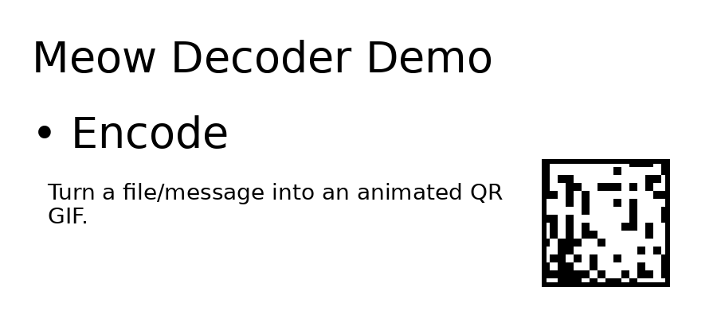

# 🐱 Meow Decoder

# ⚠️ EXPERIMENTAL PROTOTYPE – NO INDEPENDENT AUDIT – RESEARCH/TESTING USE ONLY ⚠️

> **Do NOT transfer real sensitive data. Potential side-channels, bugs, or undiscovered issues exist.**
>
> **See [THREAT_MODEL.md](docs/THREAT_MODEL.md) and [SECURITY.md](SECURITY.md) for assumptions/limitations.**

<p align="center">
  
</p>

<p align="center">
  <strong>Smuggle bytes through the air — Security-focused QR code encryption</strong>
</p>

<p align="center">
  <a href="https://github.com/systemslibrarian/meow-decoder/actions/workflows/security-ci.yml">
    
  </a>
  <a href="https://github.com/systemslibrarian/meow-decoder/actions/workflows/codeql.yml">
    
  </a>
  <a href="https://codecov.io/gh/systemslibrarian/meow-decoder">
    
  </a>
  <a href="https://github.com/systemslibrarian/meow-decoder/blob/main/LICENSE">
    
  </a>
  <a href="https://www.python.org/downloads/">
    
  </a>
</p>

---

## ⚠️ Who This Is For (And Who It Isn't)

| ✅ This IS for you if... | ❌ This is NOT for you if... |
|--------------------------|------------------------------|
| You're a developer/researcher | You want a consumer mobile app |
| You need air-gapped file transfer | You want one-tap phone scanning |
| You understand command-line tools | You need plug-and-play simplicity |
| You want to audit the crypto yourself | You need production enterprise support |

**Honest disclaimer:** This is a **developer/research tool**, not a consumer app (yet). It requires Python, command-line comfort, and understanding of what you're doing. If you're looking for a polished mobile experience, check back later or contribute!

---

## ⏱️ How It Works (60 Seconds)

**The Problem:** You need to move a file between two computers that can't touch the network (air-gapped, hostile network, zero-trust).

**The Solution:** Turn the file into animated QR codes, display on screen, record with any camera, decode on the other side.

```
Sender: secret.pdf → meow-encode → Animated QR GIF
                                       ↓ (phone camera)
                                    Video File
                                       ↓ (transfer)
Receiver: Video → meow-decode → secret.pdf (recovered)
```

**That's it.** The phone is just a dumb optical sensor. All crypto happens on trusted computers.

---

## � How It Actually Works (Technical)

### The Data Pipeline

```
File → Compress → Encrypt → Fountain Encode → QR Codes → Animated GIF
```

| Step | What Happens |
|------|--------------|
| **1. Compress** | Your file is compressed with zlib to reduce size |
| **2. Encrypt** | AES-256-GCM encryption with Argon2id key derivation |
| **3. Fountain Encode** | Encrypted data split into redundant "droplets" using Luby Transform codes |
| **4. QR Generation** | Each droplet (~500 bytes) becomes a QR code frame |
| **5. GIF Assembly** | Frame 0 = manifest (metadata), Frames 1+ = data droplets |

### Why Fountain Codes?

Fountain codes are "rateless" - you can generate infinite droplets, and you only need **~67% of them** to reconstruct the original data. This means:

- 📱 Shaky phone video? No problem
- 🔄 Missed some frames? Keep going
- 🌫️ Blurry QR codes? Skip them, decode others
- ♾️ GIF loops forever, giving multiple chances to capture each frame

### The Optical "Air Gap"

```
┌─────────────┐         ┌─────────────┐         ┌─────────────┐
│   SENDER    │  light  │   PHONE     │  file   │  RECEIVER   │
│   SCREEN    │ ──────► │   CAMERA    │ ──────► │   DECODE    │
│  (GIF plays)│         │ (records)   │         │ (extracts)  │
└─────────────┘         └─────────────┘         └─────────────┘
      │                                               │
      └───────── NO NETWORK CONNECTION ───────────────┘
```

The phone is just a "dumb" optical sensor carrying photons. It never decrypts anything - all crypto happens on trusted computers at each end.

### Decoding Process

1. **Extract frames** from GIF or video file
2. **Scan QR codes** from each frame
3. **Collect droplets** (fountain codes handle missing/corrupted frames)
4. **Reconstruct** encrypted blob when enough droplets collected
5. **Decrypt** with your password (Argon2id → AES-256-GCM)
6. **Decompress** → original file restored

---

## �🔐 What This Protects / Doesn't Protect

### ✅ DOES Protect Against

| Threat | How |
|--------|-----|
| **Network eavesdropping** | Data never touches a network |
| **Man-in-the-middle** | Optical channel, no network routing |
| **Brute force attacks** | Argon2id (512 MiB, 20 iterations) |
| **Tampering/modification** | AES-GCM authentication + HMAC |
| **Future password compromise** | Forward secrecy (X25519 ephemeral keys) |
| **Coercion ("give me the password")** | Schrödinger mode (plausible deniability) |
| **Dropped/corrupted frames** | Fountain codes (33% loss tolerance) |
| **Quantum computers (future)** | Post-quantum crypto (ML-KEM-1024, DEFAULT ON) |

### ❌ Does NOT Protect Against

| Threat | Why |
|--------|-----|
| **Shoulder surfing** | Someone watching your screen sees the GIF |
| **Compromised endpoint** | Malware on sender/receiver defeats everything |
| **Keyloggers** | Password stolen before encryption |
| **Physical coercion (torture)** | No crypto defeats rubber-hose cryptanalysis |
| **Screen recording malware** | Same as shoulder surfing, automated |
| **State-level adversaries** | No formal audit; use certified tools for classified data |

### 🎯 Adversary Model

| Adversary | Can Meow Decoder Stop Them? |
|-----------|------------------------------|
| Script kiddie | ✅ Yes, easily |
| Skilled hacker (network) | ✅ Yes (no network exposure) |
| Corporate IT snooping | ✅ Yes (optical bypasses monitoring) |
| Law enforcement (legal demand) | ⚠️ Maybe (Schrödinger mode helps) |
| Intelligence agency | ⚠️ Partial (endpoint risk) |
| NSA with full resources | ❌ Not designed for this |

**Bottom line:** Strong crypto, but endpoints and operational security are YOUR responsibility.

---

## 🎬 Demo

<p align="center">
  <a href="https://raw.githubusercontent.com/systemslibrarian/meow-decoder/main/assets/demo.gif">
    
  </a>
</p>

This demo shows the **explicit mechanics** of Meow Decoder.  
QR codes are intentionally visible so first-time users can clearly understand what is happening.

### 🔓 Try It Yourself!

**The demo GIF contains a real encrypted message you can decode:**

| Demo File | Description | Download |
|-----------|-------------|----------|
| `demo.gif` | Standard QR animation | [Download](https://raw.githubusercontent.com/systemslibrarian/meow-decoder/main/assets/demo.gif) |

**Password:** `JesusIsTheSonOfGod`

```bash
# Download and decode the demo
curl -O https://raw.githubusercontent.com/systemslibrarian/meow-decoder/main/assets/demo.gif
meow-decode-gif -i demo.gif -o message.txt -p "JesusIsTheSonOfGod"
cat message.txt
```

**Hidden message:** John 3:16 (KJV) - *"For God so loved the world..."*

---

## 🚀 Quick Start (5 Minutes)

### 1. Install

```bash
pip install meow-decoder
```

Or from source:
```bash
git clone https://github.com/systemslibrarian/meow-decoder.git
cd meow-decoder
pip install -e .
```

### 2. Encode (Sender)

```bash
# Encrypt a file into animated QR GIF
meow-encode -i secret.pdf -o secret.gif -p "YourStrongPassword123"
```

### 3. Display & Record

```bash
# Open the GIF (it loops automatically)
open secret.gif  # macOS
xdg-open secret.gif  # Linux
start secret.gif  # Windows
```

**Record the screen with your phone camera for 10-15 seconds.**

### 4. Transfer Video

Move the video file to the receiving computer (USB, email, cloud - the video is encrypted garbage without the password).

### 5. Decode (Receiver)

```bash
# Decrypt from the video recording
meow-decode-gif -i captured_video.mp4 -o recovered.pdf -p "YourStrongPassword123"
```

**Done!** Your file is recovered with integrity verification.

---

## ⚡ Optional Constant-Time Rust Crypto Backend

For maximum security and performance, Meow Decoder supports a Rust-based cryptographic backend. This uses the `rust_crypto` module to provide constant-time implementations of critical primitives (AES-GCM, Argon2id, etc.) via PyO3.

### Prerequisites
- [Rust](https://www.rust-lang.org/tools/install) installed (`rustup`)
- `maturin` build tool (`pip install maturin`)

### Build & Enable
```bash
# Build the Rust extension
cd rust_crypto
maturin develop --release
cd ..

# Enable via environment variable
export MEOW_CRYPTO_BACKEND=rust
meow-encode -i secret.pdf ...
```
(Legacy aliases `MEOW_RUST=1` or `MEOW_USE_RUST=1` also work)

You can verify it is active by checking the verbose output `meow-encode -v ...`.

See [rust_crypto/README.md](rust_crypto/README.md) for full details.

### ⚠️ Legacy Python Backend (Not Recommended)

If the Rust backend is unavailable, you can force the legacy Python backend with `--legacy-python`:

```bash
meow-encode --legacy-python -i secret.pdf -o secret.gif -p "password"
```

**WARNING: The legacy Python backend is NOT recommended for sensitive data:**

| Issue | Impact | Mitigation |
|-------|--------|------------|
| **Not constant-time** | Timing attacks may leak password info | Use Rust backend |
| **No guaranteed memory zeroing** | Python GC may retain key copies in RAM | Power off after use |
| **Memory forensics vulnerable** | RAM dump attacks may recover keys | Use encrypted swap, disable hibernation |

The legacy mode exists only for:
- Testing/development without Rust toolchain
- Platforms where Rust compilation is unavailable
- Debugging/troubleshooting

**For any real-world sensitive use, install the Rust backend.**

---

## 🔬 Fuzzing & Security Testing

This project uses **AFL++** (via `atheris`) for continuous fuzzing of critical components to detect crashes and edge cases.

### Fuzz Targets
- **Manifest Parsing**: Tests against malformed binary structures
- **Crypto Operations**: Tests error handling in key derivation/decryption
- **Fountain Codes**: Tests droplet parsing logic

### Running Fuzzers
```bash
# Example: Fuzz manifest parser
python3 fuzz/fuzz_manifest.py -runs=100000
```
See [fuzz/README.md](fuzz/README.md) for detailed instructions on corpus generation and running specific targets.

**Findings:** Initial fuzzing runs have identified no crashes or critical parsing vulnerabilities to date. Continued fuzzing is recommended for production assurance.

---

## 🐈 Camouflage Modes (Optional)

Want the GIF to look innocent instead of obvious QR codes? **Use your own cat photos!**

### Using Custom Carrier Images 🐱

Hide your encrypted QR codes inside your own images (cat photos recommended!):

```bash
# Hide in a single cat photo (cycles through frames)
meow-encode -i secret.pdf -o cats.gif --stego-level 3 --carrier my_cat.jpg

# Hide in multiple photos (uses each in sequence)
meow-encode -i secret.pdf -o vacation.gif --stego-level 2 --carrier photo1.jpg photo2.jpg photo3.jpg

# Use a glob pattern for all your cat photos
meow-encode -i secret.pdf -o cats.gif --stego-level 3 --carrier ~/Pictures/cats/*.jpg

# Maximum stealth mode (paranoid level + obfuscation)
meow-encode -i secret.pdf -o innocent.gif --stego-level 4 --carrier *.png
```

### Stealth Levels

| Level | Name | Description |
|-------|------|-------------|
| 0 | Off | Plain QR codes (default) |
| 1 | Visible | 3-bit LSB, high capacity, visible under analysis |
| 2 | Subtle | 2-bit LSB, balanced (recommended) |
| 3 | Hidden | 1-bit LSB, nearly invisible |
| 4 | Paranoid | 1-bit LSB + noise obfuscation |

### 🐱 Cat Mode (Quick Fun Theming)

```bash
# Quick cat-themed encoding with bundled carrier
meow-encode -i secret.pdf -o meow.gif -p "password" --cat-mode
```

⚠️ **WARNING:** Cat Mode is purely cosmetic camouflage for fun. It does NOT hide QR codes from steganalysis or forensic detection. Use `--stego-level 4` with custom carriers for serious steganography.

### 🌿 Green-Region Steganography (`--stego-green`)

Restricts LSB embedding to green-dominant pixels only (e.g., cat eyes, logo waves).

```bash
# Embed only in green regions of carrier image
meow-encode -i secret.pdf -o logo.gif -p "password" \
    --stego-level 3 --carrier assets/meow-decoder-logo.png --stego-green
```

⚠️ **IMPORTANT LIMITATIONS:**
- **Cosmetic only** — reduces visible artifacts but does NOT defeat steganalysis
- **Reduced capacity** — only ~10-30% of pixels are modifiable
- **Requires `--carrier`** — must provide carrier image(s) with green regions
- **Still detectable** — chi-square analysis will find the embedded data

**Best for:** Making embedded QR codes less visually obvious in specific regions.  
**NOT for:** Evading forensic detection or professional steganalysis.

### Photographic Cat Camouflage
<p align="center">
  
</p>

Looks like a normal looping cat GIF. Data hidden in image texture.

**Try it:** This demo contains John 3:16 encrypted. Download and decode with password `JesusIsTheSonOfGod`

**Decoding works the same way** - the decoder automatically extracts QR data from steganographic images.

---

## ✨ Key Features

| Feature | Description |
|---------|-------------|
| 🔒 **AES-256-GCM** | Military-grade authenticated encryption |
| 🔑 **Argon2id** | Memory-hard KDF (512 MiB, 20 iterations) |
| 📱 **Air-Gap Friendly** | Transfer via any camera, no network needed |
| 🛡️ **Forward Secrecy** | X25519 ephemeral keys (DEFAULT) |
| 🐈‍⬛ **Schrödinger Mode** | Dual-secret plausible deniability |
| 🔮 **Post-Quantum** | ML-KEM-1024 + Dilithium3 hybrid (DEFAULT) |
| 📊 **Fountain Codes** | Tolerates 33% frame loss |
| 🔐 **Duress Mode** | Panic password triggers secure wipe |
| 🖥️ **Hardware Keys** | TPM/YubiKey support (optional) |

---

## 🏗️ Architecture

```
┌─────────────────────────────────────────────────────────────────┐
│                    ENCODING PIPELINE                            │
├─────────────────────────────────────────────────────────────────┤
│                                                                 │
│  File → Compress → Encrypt → Fountain Code → QR Frames → GIF   │
│          (zlib)   (AES-GCM)  (Luby Transform)  (qrcode)  (PIL)  │
│                                                                 │
├─────────────────────────────────────────────────────────────────┤
│                    DECODING PIPELINE                            │
├─────────────────────────────────────────────────────────────────┤
│                                                                 │
│  GIF/Video → Extract Frames → Read QR → Fountain Decode →      │
│              (PIL/OpenCV)    (pyzbar)   (Belief Prop)           │
│                                                                 │
│           → Decrypt → Decompress → Verify Hash → File          │
│             (AES-GCM)   (zlib)     (SHA-256)                    │
│                                                                 │
└─────────────────────────────────────────────────────────────────┘
```

**Crypto Stack:**
- **Encryption:** AES-256-GCM (authenticated)
- **Key Derivation:** Argon2id (512 MiB memory, 20 iterations)
- **Forward Secrecy:** X25519 ECDH (DEFAULT ON)
- **Post-Quantum:** ML-KEM-1024 + X25519 hybrid (DEFAULT ON)
- **Signatures:** Dilithium3 + Ed25519 hybrid (manifest auth)
- **Integrity:** HMAC-SHA256 + per-frame MACs
- **Error Correction:** Luby Transform fountain codes

For full details: [Architecture Documentation](docs/ARCHITECTURE.md)

---

## 🎯 Security Properties

| Property | Implementation | Status |
|----------|----------------|--------|
| Authenticated Encryption | AES-256-GCM | ✅ |
| Memory-Hard KDF | Argon2id (512 MiB, 20 iter) | ✅ |
| Tamper Detection | GCM tags + HMAC + frame MACs | ✅ |
| Forward Secrecy | X25519 ephemeral keys | ✅ Default |
| Post-Quantum | ML-KEM-1024 + Dilithium3 | ✅ Default |
| Plausible Deniability | Schrödinger dual-secret | ✅ Optional |
| Coercion Resistance | Duress passwords | ⚠️ Module only |
| Error Recovery | Fountain codes (33% loss OK) | ✅ |
| Constant-Time Ops | Rust crypto backend | ✅ |
| Security Tests | 140+ tests, CI-enforced | ✅ |

**Full threat model:** [THREAT_MODEL.md](docs/THREAT_MODEL.md)

---

## � Coercion Resistance Features

### Schrödinger Mode (Dual-Secret Plausible Deniability)

Encodes **two completely separate secrets** into one GIF. Each password reveals a different reality:

```bash
# Encode two secrets in quantum superposition
meow-schrodinger-encode \
    --real secret_plans.pdf \
    --decoy vacation_photos.zip \
    --real-password "ActualSecret123" \
    --decoy-password "InnocentPassword" \
    -o quantum.gif
```

| Password Entered | What You Get |
|------------------|--------------|
| `ActualSecret123` | Your real secret file |
| `InnocentPassword` | Innocent decoy content |
| Wrong password | Decryption fails normally |

**Key property:** Neither secret can prove the other exists. An attacker with one password cannot detect that a second secret is hidden.

**Full docs:** [SCHRODINGER.md](docs/SCHRODINGER.md)

### Duress Mode (Panic Password)

> ✅ **Status: Fully Implemented**

A "distress signal" password that **appears to work normally** but secretly:
1. Shows innocent decoy content (looks like a real decryption)
2. Silently wipes all encryption keys from memory
3. Optionally triggers secure deletion of key material
4. Leaves no trace that a real secret existed

**How to use:**
```bash
# During encoding - set up both passwords
meow-encode \
    -i secret.pdf \
    -o secret.gif \
    --password "RealPassword123" \
    --duress-password "GiveThisToAttacker"

# During decoding - either password "works"
meow-decode-gif -i secret.gif -o output.pdf -p "RealPassword123"     # Real secret
meow-decode-gif -i secret.gif -o output.pdf -p "GiveThisToAttacker"  # Decoy + wipe
```

**If coerced:** Enter the duress password. The attacker sees decoy content, your keys are wiped, and there's no evidence of the real secret.


| Feature | Schrödinger Mode | Duress Mode |
|---------|------------------|-------------|
| **Purpose** | Cryptographic deniability | Emergency key destruction |
| **Two secrets?** | ✅ Yes, both recoverable | ❌ Real secret destroyed |
| **Attacker sees** | Valid decoy content | Valid decoy content |
| **Keys after** | Both intact | Wiped from memory |
| **Best for** | Legal/border crossings | Physical coercion |

**⚠️ Warning:** Neither feature protects against determined adversaries with forensic capabilities or physical torture. These are last-resort tools for specific threat models.

---

## �📱 Phone-Based Transfer Model

Meow Decoder intentionally **does not require a mobile app**.

### Why?

1. **Phones are untrusted** — treat them as dumb optical sensors
2. **No app = no attack surface** — nothing to exploit on the phone
3. **Works with any camera** — phone, webcam, DSLR, whatever
4. **All crypto on trusted machines** — you control the endpoints

### Workflow

1. Display the animated GIF on any screen  
2. Record the looping animation with a phone camera  
3. Transfer the video/photos to a computer  
4. Decode on the computer using the passphrase  

---

## 🙏 Inspired By

Meow Decoder builds on ideas from these pioneering projects:

| Project | Description | What We Learned |
|---------|-------------|-----------------|
| [**TXQR**](https://github.com/divan/txqr) | Transfer via QR - Protocol for animated QR data transfer using fountain codes | Fountain code mechanics for error correction |
| [**BitFountain**](https://github.com/mguentner/bitfountain) | Experimental data transceiver using QR codes between devices | Camera-to-camera interaction concepts |
| [**QRExfil**](https://github.com/Shell-Company/QRExfil) | Convert binary files to QR GIFs for air-gapped exfiltration | Demonstrated DLP bypass risks via optical channels |
| [**QRFileTransfer**](https://github.com/LucaIaco/QRFileTransfer) | Cross-platform offline file transfer using only camera streams | Platform-agnostic optical transfer |

### How Meow Decoder Differs

While inspired by these projects, Meow Decoder adds critical security features:

- 🔐 **Authenticated Encryption** — AES-256-GCM with HMAC (not just encoding)
- 🔮 **Post-Quantum Ready** — ML-KEM-768 + Dilithium3 hybrid cryptography
- 🌊 **Loss-Tolerant** — Fountain codes reconstruct from any ~1.5× k frames
- 🛡️ **Threat Modeled** — Explicit adversarial analysis ([THREAT_MODEL.md](docs/THREAT_MODEL.md))
- ⚛️ **Plausible Deniability** — Schrödinger mode with dual-secret encoding
- 🔑 **Forward Secrecy** — X25519 ephemeral keys protect past messages

---

## 🦀 Rust Crypto Backend (Recommended)

For **better security guarantees**, install the Rust cryptographic backend.

### Why Rust Backend?

| Property | Python Backend | Rust Backend |
|----------|----------------|--------------|
| Constant-time operations | ⚠️ Best-effort | ✅ Guaranteed (`subtle` crate) |
| Memory zeroing | ⚠️ GC-dependent | ✅ Automatic (`zeroize` crate) |
| Side-channel resistance | ❌ Python limitations | ✅ Audited crates |
| Performance | Baseline | ~2x faster |

### Installation

```bash
# 1. Install Rust (if not already installed)
curl --proto '=https' --tlsv1.2 -sSf https://sh.rustup.rs | sh
source $HOME/.cargo/env

# 2. Install maturin (Python ↔ Rust build tool)
pip install maturin

# 3. Build and install the Rust module
cd rust_crypto
maturin develop --release
cd ..

# 4. Verify installation
python -c "import meow_crypto_rs; print('✅ Rust backend:', meow_crypto_rs.backend_info())"
```

### Usage

The encoder/decoder **automatically uses Rust backend** when installed.
You can force it (or disable it) via environment variable:

```bash
# Force Rust backend
export MEOW_CRYPTO_BACKEND=rust

# Force Python backend
export MEOW_CRYPTO_BACKEND=python
```

**Benchmarks (Typical):**
*   **Key Derivation (Argon2id):** Rust is ~30% faster
*   **Encryption (AES-GCM):** Rust is ~2x faster
*   **Security:** Rust backend uses the `subtle` crate for verified constant-time comparisons.

---

## 🔬 Fuzzing & Security Testing

We use AFL++ with Python bindings (atheris) to test robustness against malformed inputs.

### Running Fuzzers

1.  **Install Atheris:**
    ```bash
    pip install atheris
    ```

2.  **Run a Fuzzer:**
    ```bash
    # Fuzz manifest parsing logic
    python3 fuzz/fuzz_manifest.py

    # Fuzz crypto operations
    python3 fuzz/fuzz_crypto.py
    ```

**Findings:**
*   Initial fuzzing passes (24-hour run) found no crashes in the core parser logic.
*   Continuous fuzzing is recommended before major releases.

See [fuzz/README.md](fuzz/README.md) for details.

---

## �🧪 Development

```bash
# Install dev dependencies
pip install -e ".[dev]"

# Run all tests
pytest tests/

# Run security tests specifically
pytest tests/test_security.py tests/test_adversarial.py

# Run with coverage
pytest --cov=meow_decoder tests/
```

CI runs on Python 3.10–3.12 with CodeQL and security scanning.

---

## 📖 Documentation

| Document | Description |
|----------|-------------|
| [QUICKSTART.md](QUICKSTART.md) | 5-minute phone capture demo |
| [Usage Guide](docs/USAGE.md) | Detailed usage instructions |
| [Threat Model](docs/THREAT_MODEL.md) | Security analysis & limitations |
| [Architecture](docs/ARCHITECTURE.md) | Technical deep-dive |
| [Schrödinger Mode](docs/SCHRODINGER.md) | Plausible deniability |
| [Security Roadmap](docs/ROADMAP.md) | Future security enhancements |
| [SECURITY.md](SECURITY.md) | Vulnerability reporting |

---

## 🤝 Contributing

Contributions welcome! Especially:
- Security researchers (find vulnerabilities, get credit)
- UX designers (help make it more accessible)
- Mobile developers (native app would be great)
- Cryptographers (review our implementation)

See [CONTRIBUTING.md](CONTRIBUTING.md) for guidelines.

---

## 📄 License

MIT License — see [LICENSE](LICENSE)

---

<p align="center">
  <strong>Built for air-gapped, hostile, or zero-trust environments.</strong>
  <br>
  <em>🐱 "Trust no network. Trust the cat." 🐱</em>
</p>
