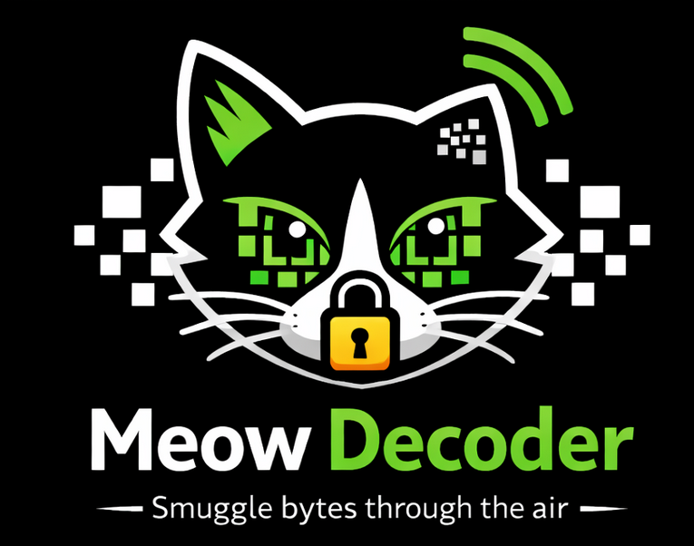
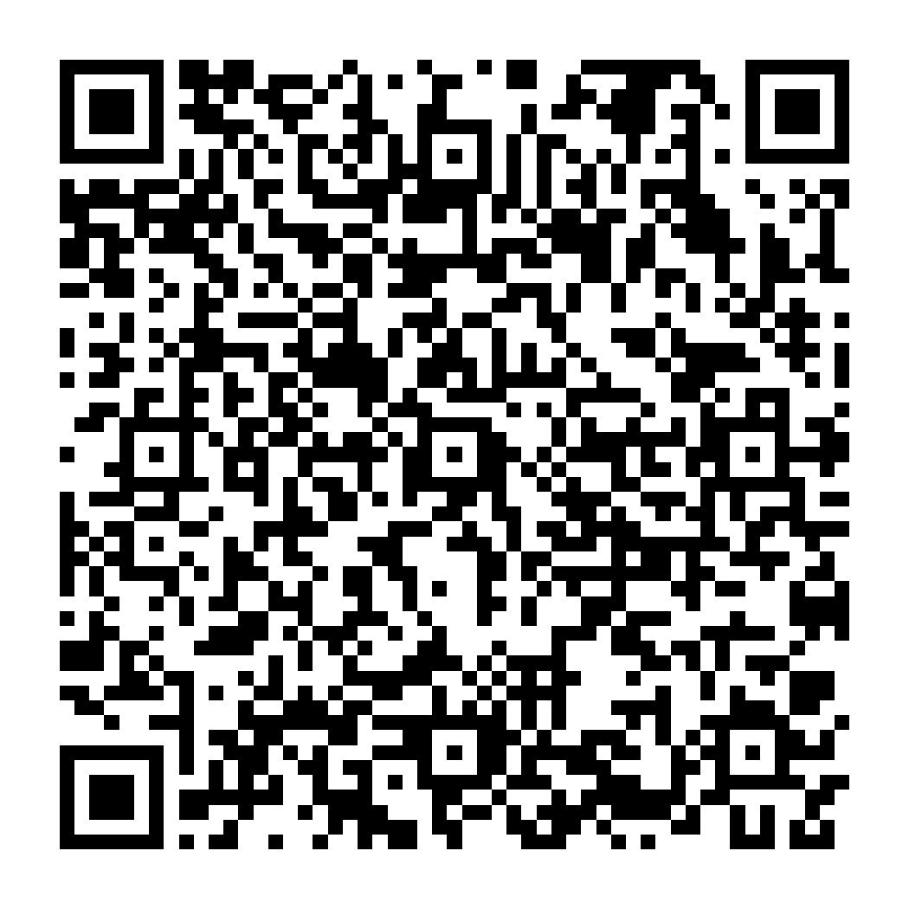
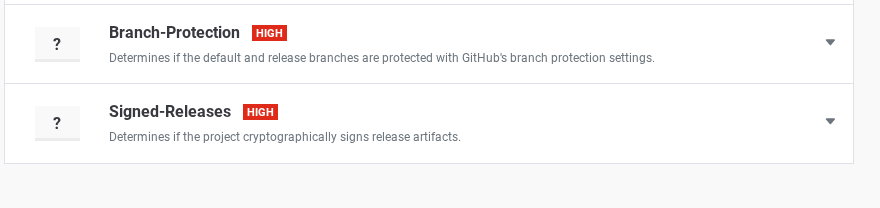

# 🐱 Meow Decoder

<p align="center">
  
</p>

<p align="center">
  <strong>Move files offline — show, scan, recover</strong>
</p>

<p align="center">
  <em>Meow Decoder moves files between computers without a network. The sender shows an encrypted transfer on screen, the receiver phone captures it with a camera, and the file is recovered on the other side. No Wi-Fi, no Bluetooth, no cloud.</em>
</p>

<p align="center">
  <strong>Why use it?</strong> When two machines shouldn't share a network — air-gapped systems, sensitive transfers, hostile environments — Meow Decoder turns any screen into a one-way data path. Files are encrypted before they leave the sender (AES-256-GCM, with optional forward secrecy and post-quantum hybrid), so the phone in the middle never sees the plaintext. Strong by default; advanced and experimental modes available when you need them.
</p>

<p align="center">
  <a href="https://github.com/systemslibrarian/meow-decoder/actions/workflows/security-ci.yml">
    
  </a>
  <a href="https://github.com/systemslibrarian/meow-decoder/actions/workflows/codeql.yml">
    
  </a>
  <a href="https://github.com/systemslibrarian/meow-decoder/actions/workflows/formal-verification.yml">
    
  </a>
  <a href="https://github.com/systemslibrarian/meow-decoder/actions/workflows/fuzz.yml">
    
  </a>
  <a href="https://github.com/systemslibrarian/meow-decoder/actions/workflows/rust-security-suite.yml">
    
  </a>
  <a href="https://codecov.io/gh/systemslibrarian/meow-decoder">
    
  </a>
  <a href="https://securityscorecards.dev/viewer/?uri=github.com/systemslibrarian/meow-decoder">
    
  </a>
  <a href="https://creativecommons.org/licenses/by-nc-sa/4.0/">
    
  </a>
  <a href="https://www.python.org/downloads/">
    
  </a>
</p>

<p align="center">
  <a href="https://github.com/systemslibrarian/meow-decoder"></a>
  <a href="https://github.com/systemslibrarian/meow-decoder"></a>
  <a href="https://github.com/systemslibrarian/meow-decoder"></a>
   <a href="https://github.com/systemslibrarian/meow-decoder"></a>
</p>

<p align="center">
  <a href="http://www.meowdecoder.com/">🌐 <strong>Live Demo → meowdecoder.com</strong></a>
</p>

---

## ⭐ Start Here — Recommended Path

If you are new to Meow Decoder, use the standard encrypted transfer flow:

1. **Encode** the file on the sender desktop.
2. **Show** the transfer on screen.
3. **Scan** with Meow Capture (mobile) or the browser receiver.
4. **Export** the capture artifact from the receiver.
5. **Recover** and decrypt on the receiving desktop.

That is the path the project is most ready to support end-to-end. See [QUICKSTART.md](QUICKSTART.md) for a five-minute walkthrough.

| Maturity | What belongs here |
|----------|-------------------|
| **Recommended** | Standard encrypted offline transfer, guided mobile capture, standard export and desktop recovery |
| **Advanced** | Redundancy tuning, diagnostics, alternate receiver workflows, hardware-backed security paths (HSM / YubiKey / TPM) |
| **Experimental** | Schrödinger mode, camouflage and stego presentation layers, deniability and duress-heavy workflows |

Recommended is the path the project optimizes for. Advanced is useful power-user capability. Experimental may still be valuable, but it isn't the default product promise — see [docs/TRUST_CENTER.md](docs/TRUST_CENTER.md) for how to think about each tier.

## Who This Is For

Meow Decoder is built for people who need to move files **without using a network** — across an air gap, between isolated machines, or anywhere Wi-Fi, Bluetooth, and cloud sync are off the table.

**Best fit if you want to:**
- move data between machines that should not share a network
- run a desktop tool on the sender and the receiver
- keep encryption applied before the file ever leaves your machine
- audit the crypto yourself

**Less ideal if you want:**
- a one-tap consumer app on both ends — the desktop side still expects a developer or operator
- a vendor-supported enterprise product with an SLA and support contract

**⚖️ Legal Notice:** Meow Decoder is not intended to circumvent law enforcement or legal obligations. Steganography and deniability features are limited and detectable under forensic examination.

**📜 Intended Use:** Designed for legal privacy needs, such as journalist-source protection under First Amendment or equivalent laws. Not for illegal activities. Consult legal experts if uncertain about your jurisdiction.

## 📱 Mobile Companion App — Download Now

[**Meow Capture**](mobile/README.md) — *A secure offline QR capture companion app for air-gapped file transfer.*

Point your phone at the animated QR code on your screen and let Meow Capture handle the rest — no network, no cloud, no traces.

### 📥 Install on Android (sideload — free)

> **Google Play Store listing coming soon.**

1. On your Android phone, go to **Settings → Apps → Special app access → Install unknown apps** and allow your browser.
2. Open this link on your phone and tap **Download**:

   **[⬇ Download Meow Capture v3.2.1 APK](https://github.com/systemslibrarian/meow-decoder/raw/main/releases/android/meow-decoder-v3.2.1-release.apk)**

   *Future APKs will move to GitHub Releases / Play Store — see [Trust Center](docs/TRUST_CENTER.md) for the maturity tier.*

3. Open the downloaded `.apk` file and tap **Install**.
4. Launch **Meow Capture** — grant camera permission when prompted.

### 🍎 iOS — Coming Soon

The iOS version is under active development. **Apple App Store listing coming soon.**
In the meantime, iOS users can [scan QR codes via the web demo](examples/wasm_browser_example.html) in Safari.

### 🏪 App Store Availability

| Platform | Status |
|----------|--------|
| Android (sideload) | ✅ Available now — [download APK above](#-install-on-android-sideload--free) |
| Google Play Store | 🔜 Coming soon |
| iOS App Store | 🔜 Coming soon |

| Feature | Detail |
|---------|--------|
| Scanner | VisionCamera v4 (MLKit / AVFoundation) |
| Security mode | Strict (wipe on background) or Convenience |
| Export | Biometric-gated JSON → Downloads, ADB pull, SHA-256 verify |
| Live coaching | Decode rate, duplicate rate, shake, exposure bias hints |
| Preflight | Calibration Wizard (5-step camera readiness check) |
| Diagnostics | Hidden long-press panel — JS lag, heap, thermal, FPS |
| Import | Scan Request QR from sender screen — no JSON file needed |
| Multi-device | `meow-decoder merge` CLI combines two-phone captures |
| Tests | 267 passing, ≥95 % coverage, zero network permissions |

---

## ⏱️ How It Works (60 Seconds)

**The Problem:** You need to move a file between two computers that can't touch the network (air-gapped, hostile network, zero-trust).

**The Solution:** Turn the file into animated QR codes, display on screen, record with any camera, decode on the other side.

```
Sender: secret.pdf → meow-encode → Animated QR GIF
                                       ↓ (phone camera)
                                    Video File
                                       ↓ (transfer)
Receiver: Video → meow-decode → secret.pdf (recovered)
```

**That's it.** The phone is just a dumb optical sensor. All crypto happens on trusted computers.

---

## 🎬 Demo

<p align="center">
  <a href="https://raw.githubusercontent.com/systemslibrarian/meow-decoder/main/assets/demo.gif">
    
  </a>
</p>

This demo shows the **explicit mechanics** of Meow Decoder.
QR codes are intentionally visible so first-time users can clearly understand what is happening.

### 🔓 Try It Yourself!

**The demo GIF contains a real encrypted message you can decode:**

| Demo File | Description | Download |
|-----------|-------------|----------|
| `demo.gif` | Standard QR animation | [Download](https://raw.githubusercontent.com/systemslibrarian/meow-decoder/main/assets/demo.gif) |

**Password:** `JesusIsTheSonOfGod`

```bash
# Download and decode the demo
curl -O https://raw.githubusercontent.com/systemslibrarian/meow-decoder/main/assets/demo.gif
meow-decode-gif -i demo.gif -o message.txt -p "JesusIsTheSonOfGod"
cat message.txt
```

**Hidden message:** John 3:16 (KJV) - *"For God so loved the world..."*

---

## 🚀 Quick Start (5 Minutes)

### 1. Install

```bash
pip install meow-decoder
```

Or from source:
```bash
git clone https://github.com/systemslibrarian/meow-decoder.git
cd meow-decoder
pip install -e .
```

### 2. Encode → Transfer → Decode

```bash
# Sender: Encrypt file into animated QR GIF
meow-encode -i secret.pdf -o secret.gif -p "YourStrongPassword123"

# Receiver: Decrypt from video recording
meow-decode-gif -i captured_video.mp4 -o recovered.pdf -p "YourStrongPassword123"
```

<details>
<summary><strong>📹 Recording & Transfer Details</strong></summary>

**Display the GIF:**
```bash
open secret.gif      # macOS
xdg-open secret.gif  # Linux
start secret.gif     # Windows
```

**Record:** Point your phone camera at the screen for 10-15 seconds (GIF loops automatically).

**Transfer:** Move the video to the receiving computer via USB, email, or cloud. The video is encrypted garbage without the password.

**Decode:** Run `meow-decode-gif` as shown above.

</details>

**Done!** File recovered with integrity verification.

---

## ✨ Key Features

| Feature | Description |
|---------|-------------|
| 🔒 **AES-256-GCM** | Military-grade authenticated encryption |
| 🔑 **Argon2id** | Memory-hard KDF (512 MiB, 20 iterations) |
| 📱 **Air-Gap Friendly** | Transfer via any camera, no network needed |
| 🛡️ **Forward Secrecy** | X25519 ephemeral keys (DEFAULT) |
| 🐈‍⬛ **Schrödinger Mode** | Dual-secret plausible deniability |
| 🔮 **Post-Quantum** | ML-KEM-768 (default, Signal PQXDH) / ML-KEM-1024 (paranoid) + ML-DSA-65 hybrid |
| 📊 **Fountain Codes** | Tolerates 33% frame loss in multi-frame QR (Python + JavaScript) |
| 🔐 **Duress Mode** | Panic password triggers secure wipe |
| 🖥️ **Hardware Keys** | HSM/PKCS#11, YubiKey PIV/FIDO2, TPM 2.0 PCR binding (`--yubikey`, `--hsm-slot`, `--tpm-seal`) |
| 📊 **Tamper Report** | Frame-by-frame MAC timeline with cluster detection |
| 📱 **Mobile Bridge** | React Native QR scanner app with JSON protocol integration |
| 🌐 **WASM Target** | Browser crypto demo available (`make build-wasm`, see [examples/](examples/)) |
| 🎨 **Multi-Layer Stego** | Six-channel steganography (LSB+STC, timing, palette, disposal, comment, temporal) for camouflage; not guaranteed against state-grade steganalysis ([audit](docs/STEGO_AUDIT_REPORT.md), [evaluation](docs/STEGO_STRENGTH_EVALUATION.md)) |

---

## 🐈 Camouflage Modes (Optional)

Want the GIF to look innocent instead of obvious QR codes? **Use your own cat photos!**

### Using Custom Carrier Images 🐱

Hide your encrypted QR codes inside your own images (cat photos recommended!):

```bash
# Hide in a single cat photo (cycles through frames)
meow-encode -i secret.pdf -o cats.gif --stego-level 3 --carrier my_cat.jpg

# Hide in multiple photos (uses each in sequence)
meow-encode -i secret.pdf -o vacation.gif --stego-level 2 --carrier photo1.jpg photo2.jpg photo3.jpg

# Use a glob pattern for all your cat photos
meow-encode -i secret.pdf -o cats.gif --stego-level 3 --carrier ~/Pictures/cats/*.jpg

# Maximum stealth mode (paranoid level + obfuscation)
meow-encode -i secret.pdf -o innocent.gif --stego-level 4 --carrier *.png
```

### Stealth Levels

| Level | Name | Description |
|-------|------|-------------|
| 0 | Off | Plain QR codes (default) |
| 1 | Visible | 3-bit LSB, high capacity, visible under analysis |
| 2 | Subtle | 2-bit LSB, balanced (recommended) |
| 3 | Hidden | 1-bit LSB, nearly invisible |
| 4 | Paranoid | 1-bit LSB + noise obfuscation |

<!--
### 🐱 Cat Mode (Quick Fun Theming)

<p align="center">
  
  <br>
  <em>Cat Mode: Because sometimes you need to smuggle data… but also look adorable doing it.</em>
</p>

**🌐 Try it in your browser!** The Cat Mode demo runs entirely in WebAssembly — no server needed:

```bash
make meow-build
# Opens http://localhost:8080/examples/wasm_browser_example.html
```

The WASM demo includes **8 encryption modes**:

| Mode | Description | Security |
|------|-------------|----------|
| 🔐 **Standard** | AES-256-GCM + Argon2id | Full parity with CLI (configurable security levels) |
| 🔑 **Forward Secrecy** | X25519 ephemeral key exchange | Full parity with CLI |
| 🔮 **Post-Quantum** | ML-KEM-768 + X25519 PQXDH (default) / ML-KEM-1024 (paranoid) | Quantum resistance |
| 🐱 **Schrödinger** | Dual-secret plausible deniability | Full parity with CLI |
| 🖼️ **Stego** | Visual steganography | Browser-limited carrier size |
| 📹 **Webcam** | Live QR scanner | All payload types supported |
| 🚨 **Duress** | Panic password wipe | Destroys localStorage keys |
| 😺 **Cat Mode** | Blinking cat eyes transport for AES-256-GCM + Argon2id ciphertext | Fun camouflage |

See the [examples/](examples/) directory for full setup instructions.

```bash
# Quick cat-themed encoding with bundled carrier
meow-encode -i secret.pdf -o meow.gif -p "password" --cat-mode
```

⚠️ **WARNING:** Cat Mode is purely cosmetic camouflage for fun. It transports the normal password-based ciphertext and does NOT hide QR codes from steganalysis or forensic detection. Use `--stego-level 4` with custom carriers for serious steganography.
-->

### 🌿 Green-Region Steganography (`--stego-green`)

Restricts LSB embedding to green-dominant pixels only (e.g., cat eyes, logo waves).

```bash
# Embed only in green regions of carrier image
meow-encode -i secret.pdf -o logo.gif -p "password" \
    --stego-level 3 --carrier assets/meow-decoder-logo.png --stego-green
```

⚠️ **IMPORTANT LIMITATIONS:**
- **Cosmetic only** — reduces visible artifacts but does NOT defeat steganalysis
- **Reduced capacity** — only ~10-30% of pixels are modifiable
- **Requires `--carrier`** — must provide carrier image(s) with green regions
- **Still detectable** — chi-square analysis will find the embedded data

**Best for:** Making embedded QR codes less visually obvious in specific regions.
**NOT for:** Evading forensic detection or professional steganalysis.

---

## 🛡️ Coercion Resistance Features

### Schrödinger Mode (Dual-Secret Plausible Deniability)

Encodes **two completely separate secrets** into one GIF. Each password reveals a different reality:

```bash
# Encode two secrets with dual-secret deniability
meow-schrodinger-encode \
    --real secret_plans.pdf \
    --decoy vacation_photos.zip \
    --real-password "ActualSecret123" \
    --decoy-password "InnocentPassword" \
    -o quantum.gif
```

| Password Entered | What You Get |
|------------------|--------------|
| `ActualSecret123` | Your real secret file |
| `InnocentPassword` | Innocent decoy content |
| Wrong password | Decryption fails normally |

> **⚠️ Honest Security Assessment:**
>
> Schrödinger mode attempts to encode two independent secrets into one output
> file. Revealing one password shows a plausible complete payload (decoy or
> real). Cryptographic deniability is **limited**: while the two encodings are
> designed to look superficially similar, advanced statistical analysis, timing
> differences, or comparison of multiple files from the same user may allow a
> nation-state forensic team to detect the presence of dual encoding or link
> transfers. This is plausible deniability under casual inspection, **not**
> perfect cryptographic deniability against unlimited compute and multiple
> samples. Duress/panic password triggers decoy reveal + key wipe, but
> memory/swap/forensic recovery may still expose keys if not done perfectly.
> **Do not rely on this feature alone against a determined state adversary.**

**See also:** [THREAT_MODEL.md](docs/THREAT_MODEL.md) for the full plausible deniability security analysis.

### Duress Mode (Panic Password)

> ✅ **Status: Fully Implemented**

A "distress signal" password that **appears to work normally** but secretly:
1. Shows innocent decoy content (looks like a real decryption)
2. Silently wipes all encryption keys from memory
3. Optionally triggers secure deletion of key material
4. Leaves no trace that a real secret existed

**How to use:**
```bash
# During encoding - set up both passwords
meow-encode \
    -i secret.pdf \
    -o secret.gif \
    --password "RealPassword123" \
    --duress-password "GiveThisToAttacker"

# During decoding - either password "works"
meow-decode-gif -i secret.gif -o output.pdf -p "RealPassword123"     # Real secret
meow-decode-gif -i secret.gif -o output.pdf -p "GiveThisToAttacker"  # Decoy + wipe
```

**If coerced:** Enter the duress password. The attacker sees decoy content, your keys are wiped, and there's no evidence of the real secret.


| Feature | Schrödinger Mode | Duress Mode |
|---------|------------------|-------------|
| **Purpose** | Limited plausible deniability | Emergency key destruction |
| **Two secrets?** | ✅ Yes, both recoverable | ❌ Real secret destroyed |
| **Attacker sees** | Valid decoy content | Valid decoy content |
| **Keys after** | Both intact | Wiped from memory |
| **Best for** | Casual inspection cover | Physical coercion |

**⚠️ Warning:** Neither feature protects against determined adversaries with forensic capabilities or physical torture. These are last-resort tools for specific threat models. A nation-state adversary with access to multiple outputs, memory forensics, or the ability to compel disclosure via torture can defeat both mechanisms. Combine with operational security (Tails OS, ephemeral boot media, dead-man switches) for layered defense.

---

## 📱 Phone-Based Transfer Model

Meow Decoder intentionally **does not require a mobile app**.

### Why?

1. **Phones are untrusted** — treat them as dumb optical sensors
2. **No app = no attack surface** — nothing to exploit on the phone
3. **Works with any camera** — phone, webcam, DSLR, whatever
4. **All crypto on trusted machines** — you control the endpoints

### Workflow

1. Display the animated GIF on any screen
2. Record the looping animation with a phone camera
3. Transfer the video/photos to a computer
4. Decode on the computer using the passphrase

---

##  ️ Other Projects

Similar projects discovered after development began:

| Project | Description | What We Learned |
|---------|-------------|-----------------|
| [**TXQR**](https://github.com/divan/txqr) | Transfer via QR - Protocol for animated QR data transfer using fountain codes | Fountain code mechanics for error correction |
| [**BitFountain**](https://github.com/mguentner/bitfountain) | Experimental data transceiver using QR codes between devices | Camera-to-camera interaction concepts |
| [**QRExfil**](https://github.com/Shell-Company/QRExfil) | Convert binary files to QR GIFs for air-gapped exfiltration | Demonstrated DLP bypass risks via optical channels |
| [**QRFileTransfer**](https://github.com/LucaIaco/QRFileTransfer) | Cross-platform offline file transfer using only camera streams | Platform-agnostic optical transfer |

### How Meow Decoder Differs

Compared to these projects, Meow Decoder adds critical security features:

- 🔐 **Authenticated Encryption** — AES-256-GCM with HMAC (not just encoding)
- 🔮 **Post-Quantum Ready** — ML-KEM-768 (default) / ML-KEM-1024 (paranoid) PQXDH hybrid cryptography
- 🌊 **Loss-Tolerant** — Fountain codes reconstruct from any ~1.5× k frames
- 🛡️ **Threat Modeled** — Explicit adversarial analysis ([THREAT_MODEL.md](docs/THREAT_MODEL.md))
- ⚛️ **Plausible Deniability** — Schrödinger mode with dual-secret encoding
- 🔑 **Forward Secrecy** — X25519 ephemeral keys protect past messages
- 🧠 **Memory Hardening** — mlockall, RLIMIT_CORE=0, PR_SET_DUMPABLE, MADV_DONTDUMP
- 🧹 **Forensic Countermeasures** — Thumbnail/clipboard/history cleanup, tmpfs enforcement, secure delete
- ⏱️ **Timing Equalization** — Constant wall-clock decode, forced dual-path, CSPRNG jitter
- 📐 **Size Normalization** — Power-of-4 padding classes prevent file size fingerprinting
- 💀 **Timed Expiry** — Self-destructing content with configurable TTL
- 🔒 **Fixed QR Version** — Prevents payload size leakage via QR structure
- 🎲 **Inter-File Decorrelation** — Randomized encoding parameters prevent profiling
- 🌐 **Air-Gap Verification** — Network/WiFi/Bluetooth/DNS detection checks

---

# 🔧 Technical Details

*Below the fur: the sections that follow are for developers, security researchers, and contributors who want to understand how the cat's claws actually work.*

---

## 🔍 How It Actually Works (Inside the Cat)

### The Data Pipeline

```
File → Compress → Encrypt → Fountain Encode (Luby Transform) → QR Codes → Animated GIF

**Multi-Frame Frame Loss Tolerance:** Payloads >2500 bytes use fountain codes (rateless erasure coding) that allow decoding from ANY ~67% of frames. This solves the "missed frame" problem in phone camera capture—autofocus lag, motion blur, and low framerates no longer cause decoding failure. Works in both Python CLI and JavaScript web demo.
```

| Step | What Happens |
|------|--------------|
| **1. Compress** | Your file is compressed with zlib to reduce size |
| **2. Encrypt** | AES-256-GCM encryption with Argon2id key derivation |
| **3. Fountain Encode** | Encrypted data split into redundant "droplets" using Luby Transform codes |
| **4. QR Generation** | Each droplet (~500 bytes) becomes a QR code frame |
| **5. GIF Assembly** | Frame 0 = manifest (metadata), Frames 1+ = data droplets |

### Why Fountain Codes?

Fountain codes are "rateless" - you can generate infinite droplets, and you only need **~67% of them** to reconstruct the original data. This means:

- 📱 Shaky phone video? No problem
- 🔄 Missed some frames? Keep going
- 🌫️ Blurry QR codes? Skip them, decode others
- ♾️ GIF loops forever, giving multiple chances to capture each frame

### The Optical "Air Gap"

```
┌─────────────┐         ┌─────────────┐         ┌─────────────┐
│   SENDER    │  light  │   PHONE     │  file   │  RECEIVER   │
│   SCREEN    │ ──────► │   CAMERA    │ ──────► │   DECODE    │
│  (GIF plays)│         │ (records)   │         │ (extracts)  │
└─────────────┘         └─────────────┘         └─────────────┘
      │                                               │
      └───────── NO NETWORK CONNECTION ───────────────┘
```

The phone is just a "dumb" optical sensor carrying photons. It never decrypts anything - all crypto happens on trusted computers at each end.

### Decoding Process

1. **Extract frames** from GIF or video file
2. **Scan QR codes** from each frame
3. **Collect droplets** (fountain codes handle missing/corrupted frames)
4. **Reconstruct** encrypted blob when enough droplets collected
5. **Decrypt** with your password (Argon2id → AES-256-GCM)
6. **Decompress** → original file restored

---

## 🔐 What This Protects / Doesn't Protect

### ✅ DOES Protect Against

| Threat | How |
|--------|-----|
| **Network eavesdropping** | Data never touches a network |
| **Man-in-the-middle** | Optical channel, no network routing |
| **Brute force attacks** | Argon2id (512 MiB, 20 iterations) |
| **Tampering/modification** | AES-GCM authentication + HMAC |
| **Future password compromise** | Forward secrecy (X25519 ephemeral keys) |
| **Coercion ("give me the password")** | Schrödinger mode (plausible deniability) |
| **Dropped/corrupted frames** | Fountain codes (33% loss tolerance) — Python + JS implementation |
| **Quantum computers (future)** | Post-quantum crypto (ML-KEM-768 with `--pq` / ML-KEM-1024 with `--paranoid`) — opt-in; default is classical X25519 (MEOW3) |

### ❌ Does NOT Protect Against

| Threat | Why |
|--------|-----|
| **Shoulder surfing** | Someone watching your screen sees the GIF |
| **Compromised endpoint** | Malware on sender/receiver defeats everything |
| **Keyloggers** | Password stolen before encryption |
| **Physical coercion (torture)** | No crypto defeats rubber-hose cryptanalysis |
| **Screen recording malware** | Same as shoulder surfing, automated |
| **State-level adversaries** | No formal audit; use certified tools for classified data |

---

## 🏗️ Architecture — How the Cat Is Built

*Five layers, from Rust primitives at the bottom to cat puns at the top. The deeper you go, the more serious things get.*

```
┌─────────────────────────────────────────────────────────────────┐
│                    ENCODING PIPELINE                            │
├─────────────────────────────────────────────────────────────────┤
│                                                                 │
│  File → Compress → Encrypt → Fountain Code → QR Frames → GIF   │
│          (zlib)   (AES-GCM)  (Luby Transform)  (qrcode)  (PIL)  │
│                                                                 │
├─────────────────────────────────────────────────────────────────┤
│                    DECODING PIPELINE                            │
├─────────────────────────────────────────────────────────────────┤
│                                                                 │
│  GIF/Video → Extract Frames → Read QR → Fountain Decode →      │
│              (PIL/OpenCV)    (pyzbar)   (Belief Prop)           │
│                                                                 │
│           → Decrypt → Decompress → Verify Hash → File          │
│             (AES-GCM)   (zlib)     (SHA-256)                    │
│                                                                 │
└─────────────────────────────────────────────────────────────────┘
```

**Crypto Stack:**
- **Encryption:** AES-256-GCM (authenticated)
- **Key Derivation:** Argon2id (512 MiB memory, 20 iterations)
- **Forward Secrecy:** X25519 ECDH (DEFAULT ON)
- **Per-Frame Ratchet:** Signal-inspired symmetric ratchet (MSR v1.2) with header encryption and key commitment
- **Post-Quantum:** ML-KEM-768 + X25519 PQXDH (default) / ML-KEM-1024 (paranoid), requires receiver PQ public key
- **Signatures:** ML-DSA-65 + Ed25519 hybrid (manifest auth)
- **Integrity:** HMAC-SHA256 + per-frame MACs + key commitment tags
- **Error Correction:** Luby Transform fountain codes

For full details: [Architecture Documentation](docs/ARCHITECTURE.md)

⚠️ **Manifest signing policy:** Signing is **mandatory** by default. Unsigned manifests are **rejected** (fail-closed).
To accept legacy unsigned manifests, set `MEOW_MANIFEST_SIGNING=off` at your own risk. **Always use signing for production/high-risk use.**

---

## 🎯 Security Properties — Nine Lives, All Accounted For

*The playful exterior is backed by real cryptographic guarantees. Here's what the cat is actually made of.*

| Property | Implementation | Status |
|----------|----------------|--------|
| Authenticated Encryption | AES-256-GCM | ✅ |
| Memory-Hard KDF | Argon2id (512 MiB, 20 iter) | ✅ |
| Tamper Detection | GCM tags + HMAC + frame MACs | ✅ |
| Forward Secrecy | X25519 ephemeral keys | ✅ Default |
| Per-Frame Forward Secrecy | Symmetric ratchet (MSR v1.2) | ✅ Optional |
| Header Encryption | HKDF-XOR masked frame indices | ✅ |
| Key Commitment | HMAC-SHA256 commitment tags | ✅ |
| Post-Quantum | ML-KEM-768/1024 + ML-DSA-65 | ✅ Default (768) / Paranoid (1024) |
| Plausible Deniability | Schrödinger dual-secret | ✅ Optional |
| Coercion Resistance | Duress passwords | ✅ |
| Error Recovery | Fountain codes (33% loss OK) | ✅ |
| Constant-Time Ops | Rust crypto backend | ✅ |
| Tamper Timeline | Frame-by-frame MAC report | ✅ |
| Security Tests | 2400+ Python + 800+ Rust tests, CI-enforced (3-gate) | ✅ |

**Full threat model:** [THREAT_MODEL.md](docs/THREAT_MODEL.md)

---

## 🦀 Under the Fur — Rust Crypto Backend (Required)

🔒 All secret-handling cryptography now lives in the Rust core (`crypto_core`). The cat may look playful — but the claws are constant-time.

The Rust cryptographic backend is **mandatory** for secure operation.

### Why Rust Backend?

| Property | Rust Backend |
|----------|--------------|
| Constant-time operations | ✅ Guaranteed (`subtle` crate) |
| Memory zeroing | ✅ Automatic (`zeroize` crate) |
| Side-channel resistance | ✅ Audited crates |
| Performance | ~2x faster |

<details>
<summary><strong>🧠 What the Rust migration actually changes (and what it doesn't)</strong></summary>

The move to Rust does **not** upgrade AES-256-GCM, X25519, HKDF, Argon2id, or ML-KEM. The math is identical — if AES-256 was 256-bit secure before, it still is.

What it improves is the **implementation layer**:

1. **Memory safety** — Rust's `zeroize` crate wipes secrets on drop. Python's garbage collector makes no such guarantee, leaving key material lingering in memory.
2. **Secret boundary clarity** — Python now handles orchestration only; Rust owns the cryptographic boundary. Cleaner to audit, harder to accidentally leak secrets.
3. **Constant-time discipline** — The `subtle` crate enforces timing-safe comparisons at the type level, not by convention.
4. **Auditability** — A compact Rust core is easier for external reviewers to read than crypto scattered across Python modules.
5. **No silent fallbacks** — If the Rust backend is missing, the system fails closed. CI enforces this. No "works locally but insecure in production" surprises.

**Honest summary:** Strong protocol before, strong protocol after. The difference is lower implementation risk, cleaner secret hygiene, and a crypto boundary you can actually audit.

See [Architecture docs](docs/ARCHITECTURE.md#what-the-rust-migration-does--and-does-not--change) for the full analysis.

</details>

### Installation

```bash
# 1. Install Rust (if not already installed)
curl --proto '=https' --tlsv1.2 -sSf https://sh.rustup.rs | sh
source $HOME/.cargo/env

# 2. Install maturin (Python ↔ Rust build tool)
pip install maturin

# 3. Build and install the Rust module
cd rust_crypto
maturin develop --release
cd ..

# 4. Verify installation
python -c "import meow_crypto_rs; print('✅ Rust backend:', meow_crypto_rs.backend_info())"
```

### Usage

The encoder/decoder uses the Rust backend by default once installed.
**No production Python module imports the `cryptography` library** — all crypto primitives (AES-GCM, HKDF, X25519, Argon2id) route through the Rust backend via `crypto_backend.CryptoBackend()`. This is enforced by an AST-based CI test (`tests/test_crypto_enforcement.py`).

> **Non-production modules** (`spec_v12/`, `experimental/`) are quarantined and excluded from the enforcement scan. See [Architecture docs](docs/ARCHITECTURE.md#production-vs-non-production-code) for details.

**Benchmarks (Typical):**
*   **Key Derivation (Argon2id):** Rust is ~30% faster
*   **Encryption (AES-GCM):** Rust is ~2x faster
*   **Security:** Rust backend uses the `subtle` crate for verified constant-time comparisons.

---

## 🔌 Hardware Security Module Integration

> **Current status:** Primitives are fully implemented in the Rust crypto core. CLI flags (`--yubikey`, `--hsm-slot`, `--tpm-seal`) are available; full end-to-end integration is in final testing.

Meow Decoder supports hardware-backed key storage for high-security environments.

### Supported Hardware

| Device | CLI Flag | Description |
|--------|----------|-------------|
| **HSM/PKCS#11** | `--hsm-slot <slot>` | Enterprise HSMs (Thales, Utimaco, SoftHSM) |
| **YubiKey** | `--yubikey --yubikey-slot <9a\|9c\|9d\|9e>` | PIV slots for key storage |
| **TPM 2.0** | `--tpm-seal <0-23>` | Platform-bound keys with PCR sealing |

### Example Usage

```bash
# Encode with YubiKey (PIV slot 9a = authentication)
meow-encode -i secret.pdf -o secret.gif --yubikey --yubikey-slot 9a

# Encode with HSM (slot 0)
meow-encode -i secret.pdf -o secret.gif --hsm-slot 0

# Encode with TPM (bind to PCR 7 = Secure Boot state)
meow-encode -i secret.pdf -o secret.gif --tpm-seal 7

# Decode requires the same hardware present
meow-decode-gif -i secret.gif -o recovered.pdf --yubikey --yubikey-slot 9a
```

### How It Works

1. **Key Generation**: Hardware generates a non-exportable key pair
2. **Key Wrapping**: AES-256 content key is wrapped by hardware public key
3. **Wrapped Key in Manifest**: GIF manifest stores the wrapped key blob
4. **Decryption**: Hardware unwraps the content key; plaintext key never leaves the device

**Security Properties:**
- Private keys **never leave the hardware** — resistant to memory dumps
- TPM PCR binding ensures decryption only on specific boot configurations
- YubiKey requires physical touch for each operation (anti-malware)

See [crypto_core/README.md](crypto_core/README.md) for Rust API details and advanced configuration.

### WebAuthn Browser Integration (Prototype)

> **Current status:** Prototype implementation available. Basic registration and key derivation working. Full integration with WASM demo in progress.

The browser demo now supports **WebAuthn/FIDO2 hardware security keys** for hardware-backed encryption:

```javascript
import { HardwareKeyManager } from './webauthn-hardware.js';

const hwManager = new HardwareKeyManager();

// Register a security key (YubiKey, Titan, etc.)
await hwManager.register("my-username");

// Derive encryption key with hybrid security:
// - Password (knowledge factor)
// - Hardware key signature (possession factor + touch)
const key = await hwManager.deriveKey(password, salt, argon2DeriveFunc);
```

**Security Model:**
- 🔐 **Key Isolation**: Private keys never leave the hardware authenticator
- 👆 **Touch Required**: Physical presence verification for each operation
- 🔑 **Hybrid Derivation**: XORs hardware signature with Argon2id password key
- 🛡️ **Multi-Factor**: Combines knowledge (password) + possession (key) + presence (touch)

**Supported Keys:**
- YubiKey 5 Series (FIDO2)
- Google Titan Security Key
- Windows Hello (platform authenticator)
- Any FIDO2/WebAuthn compatible device

**Implementation Files:**
- [`examples/webauthn-hardware.js`](examples/webauthn-hardware.js) — Core WebAuthn integration
- [`tests/test_webauthn_integration.html`](tests/test_webauthn_integration.html) — Browser-based unit tests

See the [examples/](examples/) directory for full setup instructions.

---

## 📱 Mobile Bridge (React Native)

> **Current status:** Production-ready. 267 passing tests, Vision Camera v4 frame processor, full state machine (`IDLE → CAPTURING → COMPLETE`), Zod-validated protocol, chunked JSON export. See [`mobile/README.md`](mobile/README.md) for setup.

The React Native QR scanner app provides a seamless mobile-to-CLI workflow for capturing animated QR codes.

### Installation

```bash
# iOS
cd mobile && npx pod-install && npx react-native run-ios

# Android
cd mobile && npx react-native run-android
```

### JSON Protocol

The mobile app communicates with the CLI via JSON over stdout/stdin or file exchange:

**Capture Request (CLI → App):**
```json
{
  "action": "capture",
  "session_id": "uuid-v4",
  "expected_frames": 45,
  "timeout_seconds": 60
}
```

**Frame Data (App → CLI):**
```json
{
  "session_id": "uuid-v4",
  "frames": [
    {"index": 0, "data": "base64...", "timestamp_ms": 1234567890},
    {"index": 1, "data": "base64...", "timestamp_ms": 1234567950}
  ],
  "capture_complete": true,
  "frames_captured": 45,
  "frames_missed": 2
}
```

**Decode Response (CLI → App):**
```json
{
  "session_id": "uuid-v4",
  "status": "success",
  "output_file": "/path/to/recovered.pdf",
  "integrity_verified": true,
  "frames_used": 43
}
```

### CLI Integration

```bash
# Export capture request for mobile app
meow-decode-gif --mobile-bridge --output-request capture_request.json

# Import captured frames from mobile
meow-decode-gif --mobile-bridge --input-frames captured_frames.json -o recovered.pdf -p "password"

# Or use pipe mode (adb/USB bridge)
adb shell cat /sdcard/meow_frames.json | meow-decode-gif --mobile-bridge -o recovered.pdf -p "password"
```

See [mobile/ARCHITECTURE.md](mobile/ARCHITECTURE.md) for full protocol specification and app architecture.

---

## 🌐 WASM Browser Demo

Run the crypto core directly in your browser — no server-side processing, fully client-side encryption.

### Web Demo vs CLI Feature Parity

| Feature | CLI (Python) | Web Demo (WASM) | Notes |
|---------|:------------:|:---------------:|-------|
| AES-256-GCM | ✅ | ✅ | Identical AEAD |
| Argon2id KDF | ✅ 512 MiB/20 iter | ✅ Configurable | Web: 64-512 MiB selectable |
| X25519 Forward Secrecy | ✅ | ✅ | Full parity |
| ML-KEM-768/1024 Post-Quantum | ✅ | ✅ | Requires `--features wasm-pq` |
| Schrödinger Mode | ✅ | ✅ | Dual-secret deniability |
| Fountain Codes | ✅ | ✅ | Full support (Python + JavaScript, 33% frame loss tolerance) |
| GIF Animation | ✅ | ✅ | Multi-frame QR with fountain codes (loss-tolerant) |
| Steganography | ✅ Level 0-4 | ⚠️ Level 1-2 | Browser canvas limitations |
| Hardware Keys | ✅ | 🔬 Prototype | WebAuthn/FIDO2 implementation available ([webauthn-hardware.js](examples/webauthn-hardware.js)) |
| Webcam Decode | ✅ | ✅ | Real-time camera scanner |
| Duress Mode | ✅ | ✅ | Panic password wipe |
| File Upload | ✅ | ✅ | Up to ~2KB per QR |

### Security Level Selection

The web demo provides **4 security levels** to balance speed vs. brute-force resistance:

| Level | Memory | Iterations | Time | Use Case |
|-------|--------|------------|------|----------|
| ⚡ Fast | 64 MiB | 3 | ~1 sec | Quick demos, low-value data |
| 🔒 Standard | 128 MiB | 8 | ~3 sec | General use |
| 🛡️ High | 256 MiB | 15 | ~8 sec | Sensitive data |
| 🔐 Paranoid | 512 MiB | 20 | ~20 sec | **Matches CLI** — life-critical |

⚠️ **For maximum security matching the Python CLI, select "Paranoid" mode.** This uses identical Argon2id parameters to the command-line tool.

### Prerequisites

- **Rust** (stable toolchain via [rustup](https://rustup.rs/))
- **wasm-pack**: `cargo install wasm-pack`
- **HTTP server**: Python's built-in works, or `npm install -g serve`

### Build the WASM Module

```bash
# Standard build (X25519 + AES-256-GCM)
make build-wasm

# With Post-Quantum ML-KEM-768/1024 support
wasm-pack build crypto_core --target web --release --features wasm-pq
```

This creates `crypto_core/pkg/` with the `.js` and `.wasm` files.

### Run the Demo

```bash
# One command: build WASM + start server
make meow-build

# Then open: http://localhost:8080/examples/wasm_browser_example.html
```

Or manually:

```bash
# Build first (if not already done)
make build-wasm

# Start HTTP server from project root
python3 -m http.server 8080

# Open in browser:
# http://localhost:8080/examples/wasm_browser_example.html
```

### Codespaces / Dev Container Notes

This repo includes a `.devcontainer/devcontainer.json` for GitHub Codespaces and VS Code Dev Containers.

**Port Forwarding is Disabled by Default** — This prevents confusing "Cannot GET /" errors and popup spam when opening a Codespace. When you're ready to run the WASM demo:

1. Run: `make meow-build`
2. Open the **Ports** tab (bottom panel)
3. Forward port 8080 (will auto-detect or right-click → Forward Port)
4. Click the forwarded URL, then navigate to `/examples/wasm_browser_example.html`

| Scenario | Action |
|----------|--------|
| First clone | Run `make meow-build` (~1-2 min to build, then serves) |
| Resume/reopen | Built files persist — just `make meow-build` starts server |
| Container rebuild | Re-run `make meow-build` |
| Rust code changes | Re-run to pick up changes |

> **Why a server?** Browsers block WASM loading from `file://` URLs. The HTTP server provides proper MIME types for `.wasm` files.

See the [examples/](examples/) directory for full details.

---

## 🧪 Development

```bash
# Install dev dependencies
pip install -e ".[dev]"

# Run all tests
pytest tests/

# Run security tests specifically
pytest tests/test_security.py tests/test_adversarial.py

# Run by marker (strict markers enforced)
pytest -m security          # Security-critical tests
pytest -m crypto            # Crypto unit tests
pytest -m "not slow"        # Skip slow tests (used in CI Gate 1)

# Run property-based tests (security invariants)
pytest tests/test_property_based.py -v --hypothesis-show-statistics

# Run with coverage
pytest --cov=meow_decoder tests/

# Self-test (verifies backend, roundtrip, fountain codec)
meow-encode --self-test

### Property-Based Testing

We use **Hypothesis** for property-based testing to verify security invariants hold for all possible inputs:

```bash
# Run with detailed statistics
pytest tests/test_property_based.py -v --hypothesis-show-statistics

# Run exhaustive profile (1000 examples per test)
pytest tests/test_property_based.py --hypothesis-profile=exhaustive
```

Key invariants tested:
- **Encrypt/Decrypt Roundtrip**: `decrypt(encrypt(x)) == x` for all x
- **Tamper Detection**: Any bit flip in ciphertext is detected
- **Nonce Uniqueness**: Same key never reuses nonce

See [docs/SECURITY_INVARIANTS.md](docs/SECURITY_INVARIANTS.md) for the complete invariant specification.

CI runs on Python 3.10–3.12 with CodeQL and security scanning.

---

## 🔬 Fuzzing & Security Testing

We use AFL++ with Python bindings (atheris) to test robustness against malformed inputs.

For the full test inventory and coverage tracking, see [tests/TEST_SUITE_README.md](tests/TEST_SUITE_README.md).

### Fuzz Targets
- **Manifest Parsing**: Tests against malformed binary structures
- **Crypto Operations**: Tests error handling in key derivation/decryption
- **Fountain Codes**: Tests droplet parsing logic

### Running Fuzzers

1.  **Install Atheris:**
    ```bash
    pip install atheris
    ```

2.  **Run a Fuzzer:**
    ```bash
    # Fuzz manifest parsing logic
    python3 fuzz/fuzz_manifest.py

    # Fuzz crypto operations
    python3 fuzz/fuzz_crypto.py
    ```

**Findings:**
*   Fuzzing results are not claimed without a recorded run log.
*   Continuous fuzzing is recommended before major releases.

See [fuzz/README.md](fuzz/README.md) for details.

---

## 🧪 Formal Verification (TLA+ / ProVerif / Verus)

Formal methods live in [formal/README.md](formal/README.md). Quick commands:

```bash
# One-command verification
make verify

# ProVerif (symbolic protocol analysis)
cd /workspaces/meow-decoder/formal/proverif
eval $(opam env)
proverif meow_encode.pv

# TLA+ (state machine model checking)
cd /workspaces/meow-decoder/formal/tla
java -jar tla2tools.jar -config MeowEncode.cfg MeowEncode.tla

# Verus (Rust proofs — guard-page memory safety only)
cd /workspaces/meow-decoder/crypto_core
verus src/lib.rs

# Tamarin (observational equivalence, optional)
cd /workspaces/meow-decoder/formal/tamarin
./run.sh
```

More details and expected results:
- [formal/README.md](formal/README.md)
- [formal/proverif/README.md](formal/proverif/README.md)

**Scope:** These methods verify protocol and wrapper invariants, not AES‑GCM itself or side‑channel resistance. Tamarin is optional but required for a full local `make verify`; CI skips it unless installed.

> **Verus proof status (honest assessment):**
>
> | Proof set | File | Status |
> |-----------|------|--------|
> | Guard-page memory safety (GB-001 – GB-008) | `verus_guarded_buffer.rs` | ✅ **Real Verus proofs** — bounds, overflow/underflow, zeroize-on-drop |
> | AEAD properties (AEAD-001 – AEAD-004) | `verus_proofs.rs` | ⚠️ **Proof stubs only** — structured as doc-comment specifications, not machine-checked Verus proofs. Properties are enforced by Rust's type system (`UniqueNonce`, `AuthenticatedPlaintext`), runtime tests, and the `zeroize` crate — not by Verus. |
>
> We do **not** claim formally verified AEAD. The AEAD wrapper's correctness rests on the `aes-gcm` crate's proven security, Rust's ownership system, and comprehensive testing.

### 🎯 Adversary Model

| Adversary | Can Meow Decoder Stop Them? (No Guarantees) |
|-----------|---------------------------------------------|
| Script kiddie | ✅ Yes, easily |
| Skilled hacker (network) | ✅ Yes (no network exposure) |
| Corporate IT snooping | ✅ Yes (optical bypasses monitoring) |
| Law enforcement (legal demand) | ❌ Not designed for this  |
| Intelligence agency | ❌ Not designed for this  |
| NSA with full resources | ❌ Not designed for this |

** Intended Use:** Designed for legal privacy needs, such as journalist-source protection under First Amendment or equivalent laws. Not for illegal activities. Consult legal experts if uncertain about your jurisdiction.

**Bottom line:** Strong crypto, but endpoints and operational security are YOUR responsibility. No guarantees.

---

## 🔒 Security Review Scope (v1.0)

*Internal security review – not a third-party audit.*

This release has undergone internal security review (not a third-party audit). Claims are tied to:
- [docs/THREAT_MODEL.md](docs/THREAT_MODEL.md) (authoritative scope)
- [docs/PROTOCOL.md](docs/PROTOCOL.md) (byte-level spec)
- [SECURITY.md](SECURITY.md) (formal methods + limitations)

If your threat model includes compromised endpoints or hardware side-channels, this tool is out of scope.

---

## 📖 Documentation — The Cat's Library

*From quick demos to deep threat analysis — everything a Cat Herder needs.*

| Document | Description |
|----------|-------------|
| [QUICKSTART.md](QUICKSTART.md) | 5-minute phone capture demo |
| [Usage Guide](docs/USAGE.md) | Detailed usage instructions |
| [Threat Model](docs/THREAT_MODEL.md) | Security analysis & limitations |
| [Architecture](docs/ARCHITECTURE.md) | Technical deep-dive |
| [Protocol Spec](docs/PROTOCOL.md) | Byte-level protocol specification |
| [Security Roadmap](docs/ROADMAP.md) | Future security enhancements |
| [Security Invariants](docs/SECURITY_INVARIANTS.md) | Formal invariant specification |
| [Spec v1.2 Reference](docs/SPEC_REFERENCE.md) | Protocol reference implementation |
| [Test Suite](tests/TEST_SUITE_README.md) | Test inventory, coverage & run instructions |
| [Mobile Bridge](mobile/ARCHITECTURE.md) | React Native QR bridge architecture |
| [Security Changes](docs/SECURITY_CHANGES.md) | Security hardening changelog |
| [Stego Audit Report](docs/STEGO_AUDIT_REPORT.md) | Steganography audit results (43/43 PASS) |
| [Stego Strength Evaluation](docs/STEGO_STRENGTH_EVALUATION.md) | Comparative steganalysis vs OpenStego, Steghide, StegX |
| [Security Claims](docs/SECURITY_CLAIMS.md) | Canonical truth file for security claims |
| [SECURITY.md](SECURITY.md) | Vulnerability reporting & supply chain security |

---

## 🐾 Contributing — Join the Clowder

We're always looking for more **Cat Herders**! Especially:
- 🌿 **Catnip Hunters** — Security researchers (find vulnerabilities, earn your catnip bounty)
- 🎨 **Grooming Specialists** — UX designers (help make it more accessible)
- 📱 **Outdoor Cats** — Mobile developers (native app would be great)
- 🔐 **Apex Predators** — Cryptographers (review our implementation)

**Contributor titles:**
| Contributions | Title |
|--------------|-------|
| First PR merged | 🐱 **Kitten** |
| 5+ contributions | 🐈 **Tabby** |
| 20+ or major feature | 🦁 **Maine Coon** |
| Core maintainer | 🐆 **Apex Predator** |

See the [Cat Herder's Handbook (CONTRIBUTING.md)](CONTRIBUTING.md) for guidelines.

**Found a vulnerability?** Check the [🌿 Catnip Bounty Program (SECURITY.md)](SECURITY.md).
**Need help?** Visit the [🐾 Cat Help Desk (SUPPORT.md)](SUPPORT.md).
**Have a feature idea?** [📦 Add to the Litter Box](https://github.com/systemslibrarian/meow-decoder/issues).

---

##   About the Meow Tone

Meow Decoder blends serious cryptography with a cat-themed personality. This is deliberate.

**Why personality?** Cryptographic tools often intimidate newcomers with walls of jargon. The cat theme lowers the barrier to entry: people who would never read a README about "AES-256-GCM with Argon2id KDF and PQXDH hybrid key exchange" will happily read about a cat smuggling secrets through an air gap. The playful surface draws people in; the formal crypto underneath keeps them safe.

**Why not personality everywhere?** Humor in the wrong place is dangerous. A joke in a domain separation label breaks interoperability. A pun in a Rust primitive name confuses auditors. Cat branding stops at the cryptographic boundary — Layers 1–2 of the architecture are dead serious, Layer 3 is professional, and Layers 4–5 are where the cat lives.

**The rule is simple:** the deeper you go, the more serious things get. If you're reading `purr_encrypt()`, you're in the personality layer. If you're reading `aes_gcm_encrypt()`, you're in the trust anchor. Both exist, and neither pretends to be the other.

See [Architecture Documentation](docs/ARCHITECTURE.md#-architectural-layer-boundaries) for the full 5-layer boundary model.

---

##  📄 License

This project is licensed under the [Creative Commons Attribution-NonCommercial-ShareAlike 4.0 International License (CC BY-NC-SA 4.0)](https://creativecommons.org/licenses/by-nc-sa/4.0/).

See [LICENSE](LICENSE) for the full license text.

---

<p align="center">
  <strong>Built for air-gapped, hostile, or zero-trust environments.</strong>
  <br>
  <em>🐱 "Trust no network. Trust the cat." 🐱</em>
  <br><br>
  <strong>🐾 Community:</strong>
  <a href="CONTRIBUTING.md">Cat Herder's Handbook</a> ·
  <a href="SECURITY.md">Catnip Bounty Program</a> ·
  <a href="SUPPORT.md">Cat Help Desk</a>
</p>

---

<p align="center">
  <em>Soli Deo Gloria</em>
  <br>
  This project is dedicated to God. May He receive all the glory.
</p>
