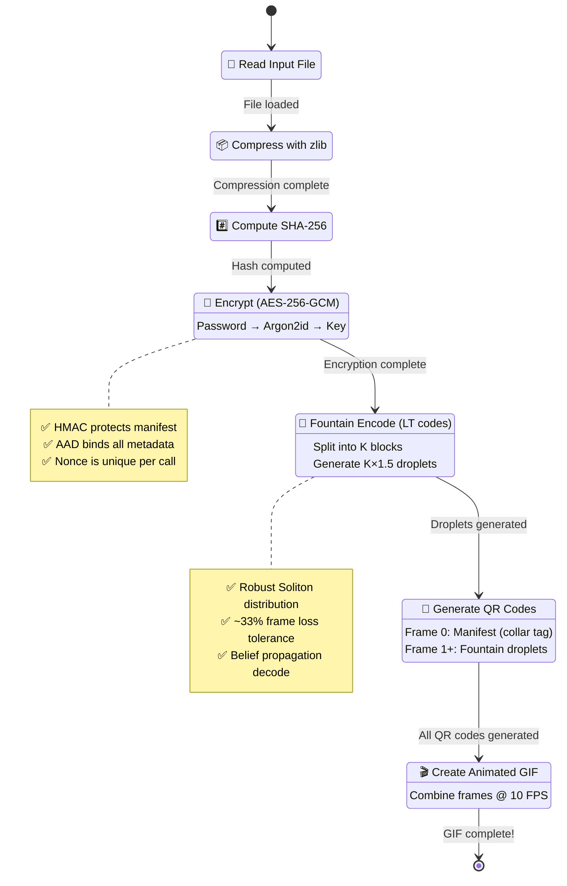
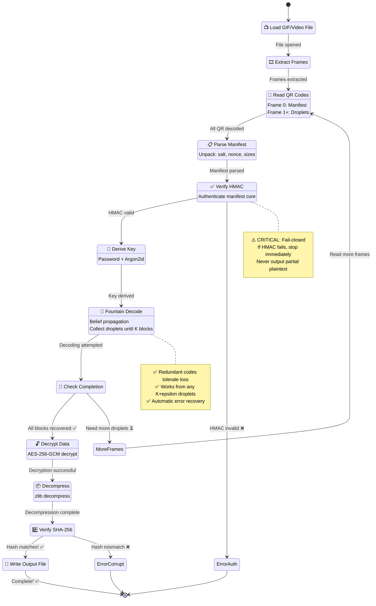
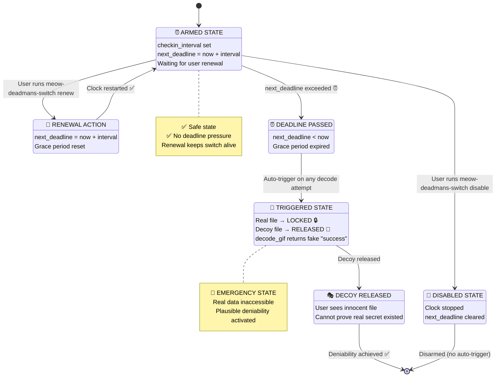
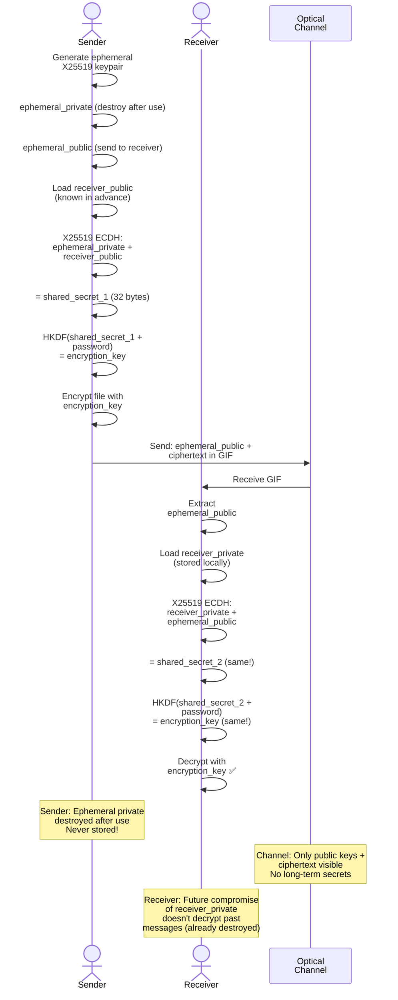
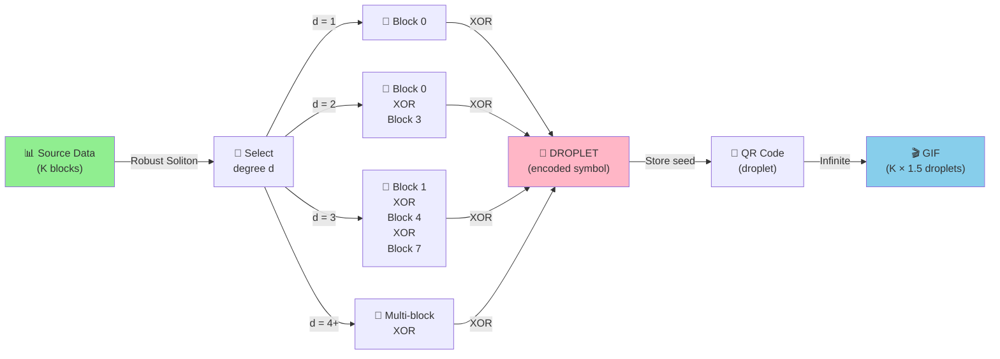
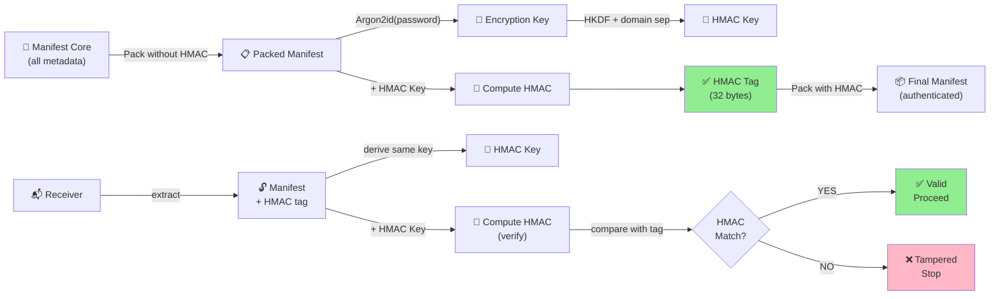
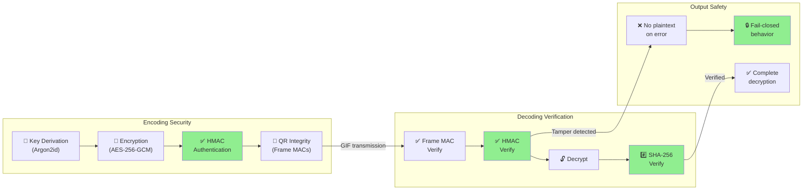

# 🐱 Protocol Diagrams - Meow Decoder v5.9

**Mermaid visualizations of Meow Decoder data flows and state machines**

---

## 🔐 Encoding Pipeline State Machine



---

## 🎯 Decoding Pipeline State Machine



---

## 🔮 Time-Lock Duress State Machine



---

## 🔐 Forward Secrecy Key Exchange (MEOW3)



---

## 🌊 Fountain Encoding Flow (Luby Transform)



---

## 🎲 Fountain Decoding Flow (Belief Propagation)

```mermaid
graph TD
    A["🎲 Collect Droplets<br/>(from GIF)"] --> B["🧩 Check Degree"]
    
    B -->|degree = 1| C["✅ Immediate<br/>Decode!"]
    B -->|degree > 1| D["⏳ Add to<br/>Pending List"]
    
    C --> E["🧬 XOR Out<br/>Solved Block"]
    E --> F["🔄 Reduce<br/>Pending Droplets"]
    
    F -->|New degree 1| G["✅ Cascade<br/>Solving!"]
    G --> E
    
    F -->|No degree 1| H{"All K<br/>blocks<br/>solved?"}
    
    H -->|YES| I["🎉 SUCCESS!<br/>Data recovered"]
    H -->|NO| J["⏳ Need more<br/>droplets"]
    J --> A
    
    style C fill:#90EE90
    style G fill:#90EE90
    style I fill:#90EE90
    style J fill:#FFB6C6
    
    note over C
        Degree 1 = raw data
        Decode immediately
    end note
    
    note over E
        Already-solved blocks
        can be XORed out
    end note
    
    note over F
        Reduces degree of
        pending droplets
    end note
```

---

## 🔒 Manifest Authentication Chain



---

## 📊 Schrödinger Quantum Superposition

```mermaid
graph TB
    A["🔐 Reality A<br/>(real secret)<br/>AES-encrypt"] -->|XOR| B["⚛️ Quantum<br/>Noise"]
    
    C["🎭 Reality B<br/>(decoy secret)<br/>AES-encrypt"] -->|XOR| B
    
    B -->|"Interleave A/B<br/>even/odd positions"| D["👁️ Superposition<br/>(both realities<br/>mixed)")
    
    D -->|"Password A"| E["🔮 Collapse<br/>to Reality A"]
    D -->|"Password B"| F["🔮 Collapse<br/>to Reality B"]
    
    E --> G["✅ Real Secret<br/>Decrypted"]
    F --> H["🎭 Decoy Secret<br/>Decrypted"]
    
    G -->|"Cannot prove"| I["❌ Reality B<br/>existence<br/>unprovable"]
    
    H -->|"Cannot prove"| J["❌ Reality A<br/>existence<br/>unprovable"]
    
    style D fill:#9966CC
    style G fill:#90EE90
    style H fill:#FFB6C6
    style I fill:#888888
    style J fill:#888888
    
    note over D
        Both realities exist
        in statistical
        superposition
        Neither provable
        without correct
        password
    end note
```

---

## 🎯 Security Verification Points



---

**Last Updated**: 2026-01-29  
**Version**: 5.9.0  
**Visualization**: Mermaid diagrams (6 flows, state machines, and verification chain)

