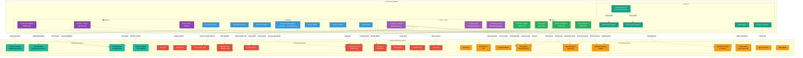

# 📊 Formal Verification Coverage Map

**Status:** Living document tracking formal verification coverage  
**Last Updated:** February 2026 (v2.2 — all tasks synchronized)

This document provides a visual map of which protocol components are covered by which formal verification tools, along with explicit assumptions and gaps.

---

## Coverage Diagram


```mermaid
graph TB
    subgraph PROTOCOL["🔐 Meow-Encode Protocol"]
        direction TB
        
        subgraph ENCODE["Encoding Pipeline"]
            E1[File Input]
            E2[Compression<br/>zlib]
            E3[Length Padding]
            E4[Encryption<br/>AES-256-GCM]
            E5[Key Derivation<br/>Argon2id]
            E6[Manifest Creation<br/>+ HMAC]
            E7[Fountain Encode<br/>LT Codes]
            E8[Frame MAC<br/>Per-frame auth]
            E9[QR Generation]
            E10[GIF Output]
        end
        
        subgraph DECODE["Decoding Pipeline"]
            D1[GIF Input]
            D2[QR Decode]
            D3[Frame MAC Verify]
            D4[Manifest Parse<br/>+ HMAC Verify]
            D5[Duress Check]
            D6[Fountain Decode<br/>Belief Prop]
            D7[Decryption<br/>AES-GCM]
            D8[Decompress]
            D9[SHA256 Verify]
            D10[File Output]
        end
        
        subgraph SECURITY["Security Features"]
            S1[Forward Secrecy<br/>X25519 Ephemeral]
            S2[Duress Mode<br/>Coercion Resistance]
            S3[Post-Quantum<br/>ML-KEM-1024]
            S4[Steganography<br/>Visual Hiding]
        end
    end
    
    subgraph FORMAL["🔬 Formal Verification"]
        direction TB
        
        subgraph TLA["📐 TLA+ / TLC"]
            T1[14 Safety Invariants<br/>MeowEncode.tla]
            T2[Fountain Loss<br/>MeowFountain.tla]
            T3[7 Streaming Invts<br/>MeowStreaming.tla]
        end
        
        subgraph PROVERIF["🔵 ProVerif"]
            P1[Secrecy Queries]
            P2[Authenticity]
            P3[Frame Correspondence<br/>SentFrame→AcceptedFrame]
            P4[Duress Safety]
            P5[Forward Secrecy]
            P6[PQ Hybrid Secrecy]
            P7[Classical Fallback]
        end
        
        subgraph TAMARIN["🟣 Tamarin"]
            TAM1[Observational Equiv<br/>MEOW3 diff]
            TAM2[Duress Indist.<br/>MEOW3]
            TAM3[PQ OE + Failure<br/>MEOW4 diff]
        end
        
        subgraph VERUS["🟢 Verus"]
            V1[Nonce Uniqueness<br/>AEAD-001]
            V2[Auth-then-Output<br/>AEAD-002]
            V3[Key Zeroization<br/>AEAD-003]
            V4[No Bypass<br/>AEAD-004]
        end
        
        subgraph LEAN["🔷 Lean 4"]
            L1[XOR Algebra]
            L2[Belief Prop Progress]
            L3[LT Decode Complete]
            L4[Erasure Tolerance]
            L5[Assumptions.lean<br/>Quarantined Axioms]
        end
    end
    
    %% TLA+ Coverage (Purple)
    T1 -.->|state invariants| E4
    T1 -.->|state invariants| E6
    T1 -.->|nonce unique| E4
    T1 -.->|auth required| D4
    T1 -.->|duress never real| D5
    T1 -.->|replay rejected| D3
    T2 -.->|loss tolerance| E7
    T2 -.->|recovery guarantee| D6
    T3 -.->|streaming EtM| E4
    T3 -.->|nonce unique| E4
    T3 -.->|domain sep| E5
    
    %% ProVerif Coverage (Blue)
    P1 -.->|secrecy| E4
    P1 -.->|password secret| E5
    P2 -.->|manifest auth| E6
    P3 -.->|frame correspondence| D3
    P4 -.->|duress path| D5
    P5 -.->|ephemeral keys| S1
    P6 -.->|PQ secrecy| S3
    P7 -.->|classical fallback| S3
    
    %% TLA+ PQ Coverage
    T1 -.->|fail-closed| S3
    
    %% Tamarin Coverage (Indigo)
    TAM1 -.->|indistinguishability| S2
    TAM2 -.->|real vs decoy| D10
    TAM3 -.->|PQ OE + failure| S3
    TAM3 -.->|failure parity| D5
    
    %% Verus Coverage (Green)
    V1 -.->|nonce fresh| E4
    V2 -.->|decrypt gated| D7
    V3 -.->|memory cleanup| E5
    V4 -.->|no shortcut| D7
    
    %% Lean Coverage (Teal)
    L1 -.->|XOR correctness| E7
    L2 -.->|progress| D6
    L3 -.->|completeness| D6
    L4 -.->|frame loss| E7
    L5 -.->|axiom audit| L2
    L5 -.->|axiom audit| L3
    
    %% Styling
    classDef tla fill:#9b59b6,stroke:#8e44ad,color:#fff
    classDef proverif fill:#3498db,stroke:#2980b9,color:#fff
    classDef tamarin fill:#8e44ad,stroke:#7d3c98,color:#fff
    classDef verus fill:#27ae60,stroke:#1e8449,color:#fff
    classDef lean fill:#16a085,stroke:#138d75,color:#fff
    classDef encode fill:#f39c12,stroke:#e67e22,color:#000
    classDef decode fill:#e74c3c,stroke:#c0392b,color:#fff
    classDef security fill:#1abc9c,stroke:#16a085,color:#000
    
    class T1,T2,T3 tla
    class P1,P2,P3,P4,P5,P6,P7 proverif
    class TAM1,TAM2,TAM3 tamarin
    class V1,V2,V3,V4 verus
    class L1,L2,L3,L4,L5 lean
    class E1,E2,E3,E4,E5,E6,E7,E8,E9,E10 encode
    class D1,D2,D3,D4,D5,D6,D7,D8,D9,D10 decode
    class S1,S2,S3,S4 security
```

---

## Coverage Matrix

| Component | TLA+ | ProVerif | Tamarin | Verus | Lean 4 |
|-----------|:----:|:--------:|:-------:|:-----:|:------:|
| **Key Derivation (Argon2id)** | ✅ | ✅ | - | ⚠️ | - |
| **Encryption (AES-GCM)** | ✅ | ✅ | - | ✅ | - |
| **Manifest HMAC** | ✅ | ✅ | - | ✅ | - |
| **Frame MAC** | ✅ | ✅ | - | - | - |
| **Frame Correspondence** | - | ✅ | - | - | - |
| **Fountain Encode** | ✅ | - | - | - | ✅ |
| **Fountain Decode** | ✅ | - | - | - | ✅ |
| **Forward Secrecy (X25519)** | ✅ | ✅ | - | - | - |
| **Duress Mode** | ✅ | ✅ | ✅ | - | - |
| **Nonce Uniqueness** | ✅ | - | - | ✅ | - |
| **Replay Resistance** | ✅ | ✅ | - | - | - |
| **Loss Tolerance** | ✅ | - | - | - | ✅ |
| **Observational Equiv (MEOW3)** | - | ⚠️ | ✅ | - | - |
| **Observational Equiv (MEOW4 PQ)** | - | - | 🚨† | - | - |
| **Failure-Trace Parity** | - | - | 🚨† | - | - |
| **Post-Quantum (ML-KEM)** | ✅ | ✅ | 🚨† | - | - |
| **Streaming (AES-CTR + EtM)** | ✅ | - | - | - | - |
| **Steganography** | - | - | - | - | - |
| **Axiom Quarantine** | - | - | - | - | ✅ |

**Legend:**
- ✅ Formally verified (or proved)
- ✅† CI-Docker required (Tamarin/Maude unavailable on musl — use `make formal-tamarin-docker`)
- 🚨† **ESCALATION NEEDED** — Model complete, verification blocked by toolchain (see [PQ_DURESS_OE_STATUS.md](PQ_DURESS_OE_STATUS.md))
- ⚠️ Partial coverage or external assumption
- `-` Not covered (out of scope or gap)

---

## Tool-Specific Details

### TLA+ / TLC (State Machine Model Checking)

**Files:**
- `formal/tla/MeowEncode.tla` - Main protocol state machine
- `formal/tla/MeowFountain.tla` - Fountain code loss tolerance
- `formal/tla/MeowStreaming.tla` - Streaming cipher (AES-256-CTR + EtM)

**Verified Invariants (MeowEncode.tla):**
1. `DuressNeverOutputsReal` - Duress path never outputs real secret
2. `NoOutputOnAuthFailure` - Failed auth produces no output
3. `ReplayNeverSucceeds` - Replayed frames detected and rejected
4. `NonceNeverReused` - Each encryption uses fresh nonce
5. `TamperedFramesRejected` - Modified frames fail auth
6. `NoAuthBypass` - No path to output without auth
7. `UnsealRequiresMatchingPCRs` - TPM unseal requires correct PCR state
8. `TamperPreventsUnseal` - Tampered platform blocks key unseal
9. `NoRealOutputWithoutUnsealedKey` - Output requires unsealed key
10. `SealedKeyNeverInChannel` - Sealed key never leaks to network
11. `FailedUnsealBlocksDecrypt` - Failed unseal prevents decryption
12. `KeyDerivationRequiresUnsealedOrSoftware` - KDF gated on key access
13. `AttackerCannotForgeUnseal` - Structural forgery prevention
14. `MEOW4NeverFallsBackToClassical` - **PQ mode never silently downgrades to classical-only** (fail-closed)

**Verified Invariants (MeowFountain.tla):**
15. `FountainDecodeGuarantee` - k droplets → recovery possible
16. `LossToleranceInvariant` - <33% loss → enough droplets survive

**Config:** ~3.6M states generated, 300K distinct, depth 22, ~90 seconds

**Verified Invariants (MeowStreaming.tla):**
17. `NonceUniqueness` - Each streaming session uses unique nonce
18. `MACCoversAllChunks` - All plaintext chunks covered by MAC
19. `DomainSeparation` - Encryption key ≠ MAC key
20. `EncryptThenMAC` - MAC computed over ciphertext (not plaintext)
21. `CounterNoWrap` - AES-CTR counter never wraps
22. `MACVerifyBeforeDecrypt` - MAC is verified before decryption
23. `TypeOK` - State-space type invariant

**Config (Streaming):** 56,991 states, 25,978 distinct, depth 17

### ProVerif (Symbolic Protocol Analysis)

**Files:**
- `formal/proverif/meow_encode.pv` - Full protocol model

**Verified Queries:**
```proverif
(* Core security *)
query attacker(real_secret).          (* SECRET — TRUE *)
query attacker(real_password).        (* SECRET — TRUE *)
query attacker(decoy_secret).         (* SECRET — TRUE *)
query attacker(duress_password).      (* SECRET — TRUE *)

(* Duress safety *)
event(DuressPasswordUsed(sid)) && event(DecoderOutputReal(sid, pt)) ==> false.  (* TRUE *)

(* Frame correspondence — replaces session-ID replay queries *)
event(AcceptedFrame(n, s, tag)) ==> event(SentFrame(n, s, tag)).  (* TRUE *)
  (* ^ Each accepted frame (cryptographically bound by nonce+salt+MAC tag)
       corresponds to a genuine encoder. Attacker cannot forge valid MACs. *)
inj-event(AcceptedFrame(n, s, tag)) ==> inj-event(SentFrame(n, s, tag)). (* FALSE *)
  (* ^ Expected: ! replication allows multiple decoders to accept same frame.
       Not a security issue — replay is handled by AEAD + nonce uniqueness. *)

(* Post-Quantum Hybrid (MEOW4) *)
query attacker(pq_shared_marker).     (* PQ SHARED SECRET — TRUE *)
query attacker(classical_fallback_marker).  (* CLASSICAL FALLBACK — TRUE *)
  (* ^ Even when ML-KEM shared secret is leaked to attacker,
       X25519 component still protects the plaintext *)

(* Auth-gated output *)
event(DecoderOutputReal(sid, pt)) ==> event(DecoderAuthenticated(sid, n, s)).  (* TRUE *)
event(DecoderOutputDecoy(sid, pt)) ==> event(DecoderAuthenticatedDuress(sid, n, s)).  (* TRUE *)
```

**Attacker Model:** Dolev-Yao (full network control)

**PQ Processes:** `EncoderPQ`, `DecoderPQ` (standard MEOW4), `EncoderPQ_LeakedKEM` (classical-fallback test)

### Tamarin Prover (Observational Equivalence)

**Files:**
- `formal/tamarin/meow_encode_equiv.spthy` - Basic equivalence (legacy)
- `formal/tamarin/MeowDuressEquiv.spthy` - MEOW3 duress OE model
- `formal/tamarin/MeowDuressEquivPQ.spthy` - MEOW4 PQ duress OE model (hybrid KEM + failure traces)

**MEOW3 Verified Properties:**
- `diffEquivLemma` - Real vs duress outputs indistinguishable
- `Duress_Never_Outputs_Real` - Separation of paths
- `Real_Password_Secret` - Password never leaked
- `Real_Secret_Confidentiality` - Secret protected

**MEOW4 PQ Model Properties:**
- `diffEquivLemma` - PQ OE under hybrid X25519 + ML-KEM-1024
- `PQ_Duress_Never_Outputs_Real` - Duress → no real plaintext under PQ
- `PQ_KEM_Ct_Integrity` - Decoder accepted same KEM ct encoder sent
- `PQ_Failure_Uniform_Observable` - All reject paths produce identical observable
- `PQ_Downgrade_Never_Succeeds` - MEOW3→MEOW4 downgrade blocked

**Run with:** `tamarin-prover --diff MeowDuressEquiv.spthy`  
**PQ model:** `tamarin-prover --diff MeowDuressEquivPQ.spthy` or `make formal-tamarin-docker`  
**Note:** Tamarin requires Maude (glibc only); use Docker on Alpine/musl.

### Verus (Rust Implementation Proofs)

**Files:**
- `crypto_core/src/verus_proofs.rs` - AEAD wrapper proofs

**Verified Properties:**
| ID | Property | Status | Method |
|----|----------|--------|--------|
| AEAD-001 | Nonce uniqueness | Tested | Runtime check |
| AEAD-002 | Auth-gated plaintext | TypeEnforced | Type system |
| AEAD-003 | Key zeroization | External | `zeroize` crate |
| AEAD-004 | No bypass | TypeEnforced | Sealed trait |

### Lean 4 (Mathematical Proofs)

**Files:**
- `formal/lean/FountainCodes.lean` - LT code correctness proofs
- `formal/lean/Assumptions.lean` - Quarantined axioms (explicit trust surface)

**Theorem Inventory:**
- `Block.xor_comm` - XOR commutativity ✅
- `Block.xor_assoc` - XOR associativity ✅
- `Block.xor_self` - Self-inverse property ✅
- `Block.xor_zero` - Identity property ✅
- `degree_one_solves` - Degree-1 droplet → singleton index ✅
- `Droplet.reduce` (with `h_unsolved` precondition) - Nonempty proof ✅
- `update_at_self` - Function.update at updated index ✅
- `update_at_other` - Function.update at different index ✅
- `solvedCount_increases_on_update` - Strict increase on update ✅
- `erasure_tolerance` - 1.5x redundancy bound ✅ (omega)
- `default_redundancy_sufficient` - 1.5x for k≥3 ✅ (trivial)

**Axioms (quarantined in Assumptions.lean):**

| ID | Name | Type | Justification |
|----|------|------|---------------|
| A1 | `lt_decode_completeness_prob` | `axiom` | Luby FOCS 2002 Thm 1; well-established coding theory result |
| A2 | `belief_propagation_progress` | `sorry` (APPROVED) | Proof sketch complete; blocked by `List.find?` spec bridge |

**Status:** Core algebra proved ✅. BP step implemented (real `Function.update`). Probability bound
stated as justified axiom. 1 narrow sorry remaining (APPROVED). All axioms quarantined in
`Assumptions.lean` for auditor visibility.

---

## Explicit Assumptions

### Cryptographic Assumptions

| Assumption | Relied Upon By | Justification |
|------------|---------------|---------------|
| AES-256 secure | All tools | NIST standard, no practical attack |
| Argon2id memory-hard | TLA+, ProVerif | OWASP recommended, GPU-resistant |
| X25519 ECDH secure | ProVerif | Curve25519 widely audited |
| SHA-256 collision-resistant | All tools | No practical collision found |
| ML-KEM-1024 IND-CCA2 secure | ProVerif, TLA+ | NIST FIPS 203 (Aug 2024), 256-bit classical / 192-bit quantum security |

### Environmental Assumptions

| Assumption | Impact | Mitigation |
|------------|--------|------------|
| Endpoints not compromised | All security void if false | Out of scope (OS/hardware trust) |
| Optical channel random loss | Fountain code guarantees | Adversarial erasure not covered |
| No timing side-channels | HMAC/password comparison | Constant-time ops in Rust backend |
| Python GC doesn't leak keys | Memory confidentiality | Best-effort zeroization |

### Model Limitations

| Model | Limitation | Consequence |
|-------|-----------|-------------|
| TLA+ | Finite state space | Bounded checking only |
| ProVerif | Symbolic abstraction | Doesn't catch impl bugs |
| Tamarin | Manual termination hints | May not terminate on complex queries |
| Verus | External assumptions for zeroize | Trust `zeroize` crate |
| Lean 4 | Probabilistic statements as `sorry` | Not machine-checked |

---

## Post-Quantum (MEOW4) Threat Model Assumptions

*Added February 2026 in support of TODO 2e from [todo-formal.md](todo-formal.md).*

### Security Model

MEOW4 uses a **hybrid key combination** of X25519 (classical) and ML-KEM-1024 (post-quantum):

```
combined_key = HKDF-SHA256(
    IKM = X25519_shared_secret || ML-KEM_shared_secret,
    info = "meow_hybrid_pq_v1"
)
```

The hybrid design ensures that breaking **either** component alone is insufficient
to recover ciphertext. This follows the NIST recommendation for PQ migration:
deploying hybrid constructions that provide at least classical security while
adding quantum resistance.

### Assumed Properties of ML-KEM-1024

| Property | Assumption | Standard Reference |
|----------|-----------|-------------------|
| IND-CCA2 security | ML-KEM-1024 is IND-CCA2 secure under the Module-LWE assumption | NIST FIPS 203 (August 2024) |
| Classical security level | 256-bit (equivalent to AES-256) | NIST Security Category 5 |
| Quantum security level | 192-bit against Grover-optimized quantum adversary | NIST estimate |
| Correct decapsulation | `kem_decap(sk, kem_encap_ct(pk(sk), r)) = kem_encap_ss(pk(sk), r)` | Functional correctness |
| Ciphertext integrity | Substituted ciphertext produces uniformly random shared secret | IND-CCA2 consequence |

### What Is Formally Verified (MEOW4)

| Property | Tool | Status | Query/Invariant |
|-----------|------|--------|----------------|
| PQ shared secret secrecy | ProVerif | ✅ TRUE | `not attacker(pq_shared_marker[])` |
| Classical-fallback secrecy | ProVerif | ✅ TRUE | `not attacker(classical_fallback_marker[])` |
| Plaintext secrecy (PQ mode) | ProVerif | ✅ TRUE | `not attacker(real_secret[])` (MEOW4 sessions) |
| No silent PQ→classical downgrade | TLA+ | ✅ PASS | `MEOW4NeverFallsBackToClassical` (3.6M states) |
| KEM ciphertext correspondence | ProVerif | FALSE* | `DecoderAcceptedPQ ==> EncoderSentPQ` |

*\*Expected FALSE: same root cause as other session-correspondence queries (cross-session replication). KEM integrity is enforced cryptographically by AAD-binding.*

### What Is NOT Formally Verified (MEOW4)

| Gap | Reason | Mitigation |
|-----|--------|------------|
| ML-KEM implementation correctness | liboqs is external C code | liboqs has its own test suite; runtime KAT checks |
| Quantum key distribution attacks | Out of scope (crypto assumption) | Rely on NIST standardization |
| ML-KEM side-channel resistance | Requires hardware-level analysis | liboqs implements countermeasures |
| Hybrid combiner domain separation | HKDF info string is fixed | Documented as assumption; single-use domain |
| ~~Tamarin OE under PQ~~ | ~~Tamarin not available on Alpine musl~~ | **RESOLVED:** `MeowDuressEquivPQ.spthy` created; CI via `make formal-tamarin-docker` |

### Classical-Fallback Guarantee (Hybrid Security)

The `EncoderPQ_LeakedKEM` process in ProVerif models the scenario where an attacker
learns the ML-KEM shared secret (PQ component). Even with this knowledge:

1. The `hkdf_hybrid(x25519_ss, pq_ss)` combiner still protects the output because
   the X25519 shared secret remains unknown
2. The `classical_fallback_marker` (encrypted under the combined key) stays secret
3. The attacker cannot compute the combined key without both shared secrets

This proves that MEOW4 provides **at least classical security** even if ML-KEM-1024
is completely broken (e.g., by a future quantum algorithm faster than expected).

---

## Known Gaps

### High Priority (Security-Critical)

1. ~~**Post-Quantum Key Exchange**: ML-KEM-1024 not formally modeled yet~~ **RESOLVED (Feb 2026):** ProVerif MEOW4 model verifies PQ shared secret secrecy, classical-fallback secrecy (ML-KEM leak → X25519 still protects), and KEM ciphertext integrity. TLA+ MEOW4NeverFallsBackToClassical invariant verified across 3.6M states.
2. ~~**Steganography Security**: Visual hiding not analyzed for detection resistance~~ **RESOLVED (Feb 2026):** Comprehensive steganography threat model added to `docs/THREAT_MODEL.md` § "STEGANOGRAPHY THREAT MODEL". Defines adversary tiers (casual → forensic), 4 carrier modes, 5 attack vectors, security boundaries. Stego provides cosmetic cover only; cryptographic deniability requires Schrödinger mode.
3. **Side-Channel Resistance**: Only partial coverage via Rust constant-time

### Medium Priority (Defense-in-Depth)

4. **Error Path Analysis**: Verus doesn't cover all error code paths — however, Tamarin PQ model now covers failure-trace parity (see `PQ_Failure_Uniform_Observable`)
5. ~~**Streaming Mode**: Low-memory streaming not formally modeled~~ **RESOLVED (Feb 2026):** `MeowStreaming.tla` models AES-256-CTR streaming with Encrypt-then-MAC (HMAC-SHA256). 7 invariants verified by TLC (56,991 states): NonceUniqueness, MACCoversAllChunks, DomainSeparation, EncryptThenMAC, CounterNoWrap, MACVerifyBeforeDecrypt, TypeOK.
6. **Resume Protocol**: Session resume not in current models
7. **Timing Equalization**: `equalize_timing()` not formally verified (would need real-time process calculus)

### Lower Priority (Completeness)

7. **QR Error Correction**: Assumed to work (PIL/zbar libraries)
8. **GIF Parsing**: Assumed robust (Pillow)
9. **Compression**: zlib assumed correct

---

## Verification Commands

```bash
# Run all formal verification
make formal-all

# Individual tools
make formal-tla              # TLC main model (MeowEncode)
make formal-tla-fountain     # TLC fountain model
make formal-tla-streaming    # TLC streaming model
make formal-proverif         # ProVerif symbolic analysis
make formal-tamarin-duress   # Tamarin MEOW3 OE (native Maude required)
make formal-tamarin-pq       # Tamarin MEOW4 PQ OE (native Maude required)
make formal-tamarin-docker   # Tamarin via Docker (MEOW3 + MEOW4)
make formal-verus            # Verus proofs
make formal-lean             # Lean 4 proofs
make formal-lean-sorry       # Sorry gate (CI)

# Negative tests (must FAIL to prove harness catches violations)
make formal-negative-tla
make formal-negative-proverif
make formal-negative-tamarin
make formal-negative          # All negative tests
```

---

## Updating This Document

When adding new formal verification:

1. Add files to appropriate `formal/` subdirectory
2. Update coverage matrix above
3. Add Make targets if needed
4. Document new assumptions explicitly
5. Update Mermaid diagram with new coverage edges

---

*This document is the authoritative source for formal verification coverage. Keep it synchronized with actual proof files.*
